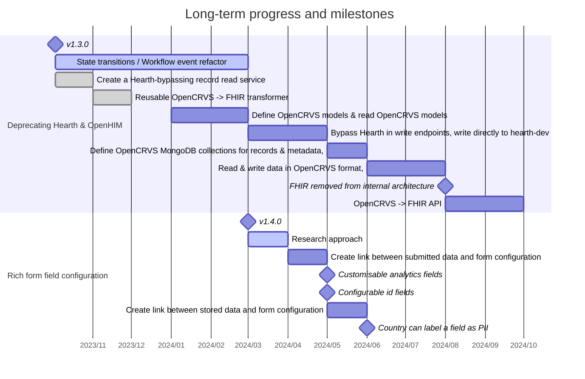

# Projects & milestones

The intent for documentation is to

* Describe our vision for future versions of OpenCRVS&#x20;
* Steer technical design
* Track and visualise the progress and direction of our long-term architecture projects

###

