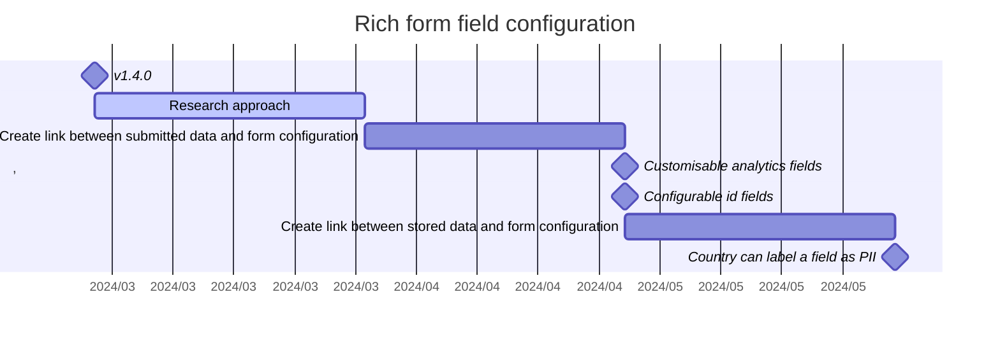

# Rich form field configuration

Adding a new event type (e.g. divorce) requires significant development effort. This is mostly because birth / death / marriage are explicitly defined in core's UI and backend code. Different events manipulate different sets of datapoints meaning the way we handle analytics, business logic, search indexing and other functionalities need to be defined explicitly.&#x20;

**Making all of this configurable in the country's form configuration would mean:**

* Fields used for deduplication can now be defined by the country.
* Countries could specify which fields are
  * identifiers that can be used for searching the record or for verifying the identity of the certificate collector
  * can be used in advanced search
  * stored for statistical purposes
  * PII and should not be shared with integrations
* Enabling countries to specify how their custom fields should be converted to FHIR or other data formats

[Github issue](https://github.com/opencrvs/opencrvs-core/issues/6372)

### Status

