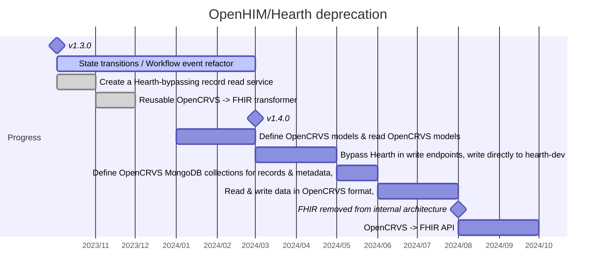

# Deprecating Hearth & OpenHIM

**Why is this important**

* **Modularity & integrations:** Moving the FHIR layer outside the core business logic will make OpenCRVS more prepared to integrate with other healthcare standards and interfaces such as MOSIP and GovStack.
* **Security:** Hearth is the primary database of OpenCRVS, however it hasn't been updated in many years and exposes OpenCRVS to security risks we cannot accurately quantify. We do not really understand how it's built and it doesn't have a community behind if
* **Performance:** The database structure enforced by Hearth significantly increases complexity. This has caused performance issues in relatively small deployments of OpenCRVS. The added complexity also significantly increases feature development time and defects.&#x20;
* **Onboarding new developers:** Because of its unnecessary complexity, it's one of the most difficult to understand for new developers. From our experience even professional developers with years of job experience struggle with the number of data models we have in use.

### Diagrams

* [Data architecture changes in steps](https://ng.myschenker.fi/npseuranta/tracking.aspx?id=888003748405)

### Status 

