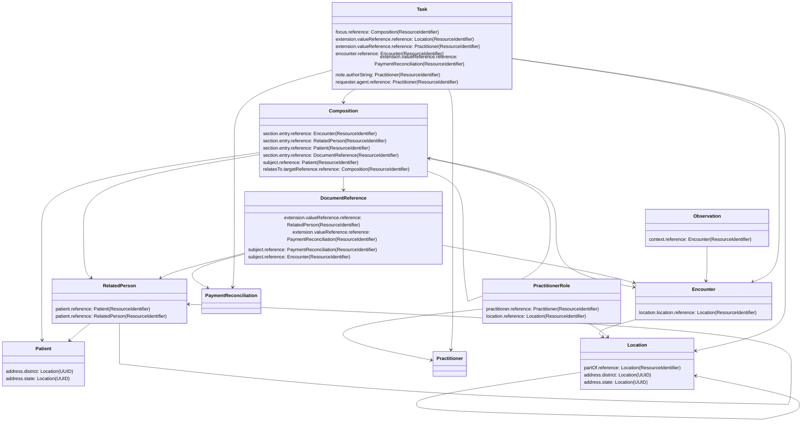

# Data structure

```mermaid

classDiagram

    class Composition {
        section.entry.reference: Encounter (ResourceIdentifier)
        section.entry.reference: RelatedPerson (ResourceIdentifier)
        section.entry.reference: Patient (ResourceIdentifier)
        section.entry.reference: DocumentReference (ResourceIdentifier)
        subject.reference: Patient (ResourceIdentifier)
        relatesTo.targetReference.reference: Composition (ResourceIdentifier)
    }
    Composition --> Encounter
    Composition --> RelatedPerson
    Composition --> Patient
    Composition --> DocumentReference
    Composition --> Composition

    class DocumentReference {
        extension.valueReference.reference: RelatedPerson (ResourceIdentifier)
        extension.valueReference.reference: PaymentReconciliation (ResourceIdentifier)
        subject.reference: PaymentReconciliation (ResourceIdentifier)
        subject.reference: Encounter (ResourceIdentifier)
    }
    DocumentReference --> RelatedPerson
    DocumentReference --> PaymentReconciliation
    DocumentReference --> Encounter

    class Encounter {
        location.location.reference: Location (ResourceIdentifier)
    }
    Encounter --> Location

    class Location {
        partOf.reference: Location (ResourceIdentifier)
        address.district: Location (UUID)
        address.state: Location (UUID)
    }
    Location --> Location

    class Observation {
        context.reference: Encounter (ResourceIdentifier)
    }
    Observation --> Encounter

    class Patient {
        address.district: Location (UUID)
        address.state: Location (UUID)
    }

    class PractitionerRole {
        practitioner.reference: Practitioner (ResourceIdentifier)
        location.reference: Location (ResourceIdentifier)
    }
    PractitionerRole --> Practitioner
    PractitionerRole --> Location

    class RelatedPerson {
        patient.reference: Patient (ResourceIdentifier)
        patient.reference: RelatedPerson (ResourceIdentifier)
    }
    RelatedPerson --> Patient
    RelatedPerson --> RelatedPerson

    class Task {
        focus.reference: Composition (ResourceIdentifier)
        extension.valueReference.reference: Location (ResourceIdentifier)
        extension.valueReference.reference: Practitioner (ResourceIdentifier)
        encounter.reference: Encounter (ResourceIdentifier)
        extension.valueReference.reference: PaymentReconciliation (ResourceIdentifier)
        note.authorString: Practitioner (ResourceIdentifier)
        requester.agent.reference: Practitioner (ResourceIdentifier)
    }
    Task --> Composition
    Task --> Location
    Task --> Practitioner
    Task --> Encounter
    Task --> PaymentReconciliation

```
