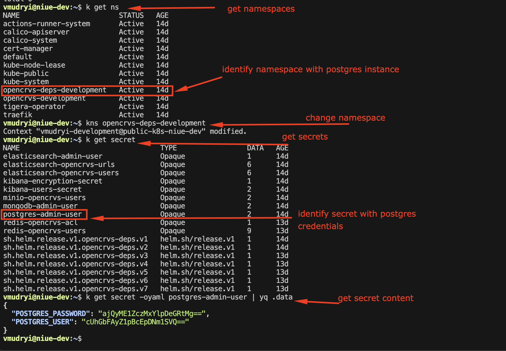

# Kubernetes - accessing dbs

Steps to get hold of the secret:

<figure><figcaption></figcaption></figure>

Decode the secret:

```
k get secret -oyaml postgres-admin-user | yq -r .data.POSTGRES_PASSWORD | base64 -d
k get secret -oyaml postgres-admin-user | yq -r .data.POSTGRES_USER | base64 -d
```

Switch to dependencies namespace

```
kns opencrvs-deps-<env>
```

Get pods, and get inside pod like so:

```
kubectl exec -it postgres-0 -- bash
```

Connect using user password combo:

```
psql -h postgres -U POSTGRES_USER -d events
```

List schemas:

```
\dn
```

List tables in the `app` schema:

```
\dt app.*
```

View the structure of the table:

```
\d app.locations
```

Query the data:

```
SELECT * FROM app.locations LIMIT 10;
```

If you want specific columns:

```
SELECT id, name FROM app.locations LIMIT 10;
```
