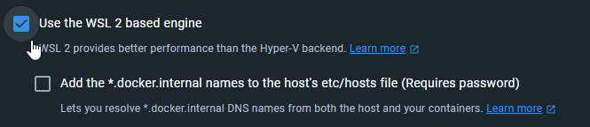

# 4.1.5.1 WSL support

## Install

For installation of WSL 2 in Windows, [refer to Microsoft's documentation.](https://learn.microsoft.com/en-us/windows/wsl/install)&#x20;

Make sure you're using Visual Studio Code to develop and install the [WSL extension](https://marketplace.visualstudio.com/items?itemName=ms-vscode-remote.remote-wsl) for it. Do **not** install Docker within the WSL Linux distribution. Docker For Desktop will automatically do that for you.


Do not install Docker within WSL. Install **Docker for Desktop** and it will do the integration for you.


## Post-install

Run Powershell, and make sure that you're running the correct WSL version, and Ubuntu is set as the default distribution in WSL.

```
PS C:\Users\dev> wsl --list -v
  NAME                   STATE           VERSION
* Ubuntu                 Running         2
  docker-desktop-data    Running         2
  docker-desktop         Running         2
```

Make sure that Docker Desktop is using WSL 2 based engine in it's settings\


<figure><figcaption></figcaption></figure>

## Usual problems

### Only one or few OpenCRVS microservices aren't running

Typically this is because Windows is reserving a specific port but the WSL Linux world doesn't pick that up. For example, if gateway fails to run, you can find in Windows Powershell what process is running in the port

```
PS C:\Users\dev> netstat -ano | findstr :7070
  TCP    127.0.0.1:7070         0.0.0.0:0              LISTENING       20352

PS C:\Users\dev> tasklist /FI "PID eq 20352"

Image Name                     PID Session Name        Session#    Mem Usage
========================= ======== ================ =========== ============
wslrelay.exe                 20352 Console                    1      8 512 K
```

### WSL hangs or running out of memory

Running all the databases and Node.js services OpenCRVS uses can demand quite a bit of memory. For WSL, we're suggesting at least 16GB of memory but the amount can vary between computers and WSL installations. It's also recommended you allow WSL use more memory by editing `.wslconfig`\
\
You can do this by pressing `Win`+`R` and enter&#x20;

```
notepad.exe %UserProfile%/.wslconfig
```

Insert this content into the file and save. Don't go above the amount of memory visible in task manager (`CTRL` + `Shift` + `ESC`)

```
[wsl2]
memory=16GB
```
