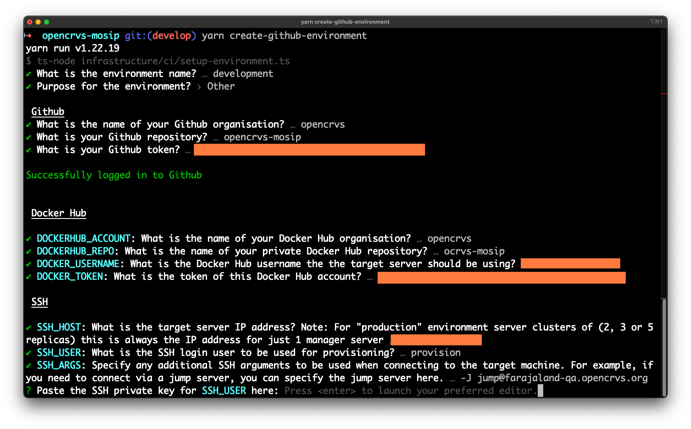
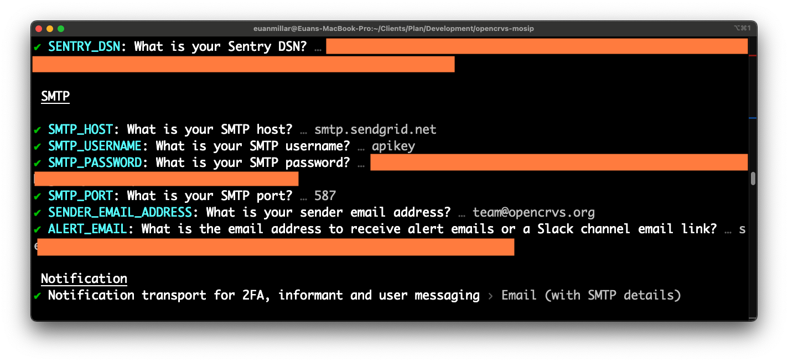

# 4.3.3 Create a Github environment

We have an automated script to generate [Github environments](https://docs.github.com/en/actions/deployment/targeting-different-environments/using-environments-for-deployment) for you along with all the application secrets that Github needs to run the continuous integration scripts.

The environments will be named according to the naming convention identical to that we have described [here](../).&#x20;

Specifically: **qa, staging, production** & for training purposes **development** (optional)**.** &#x20;

The **backup** environment does not need a corresponding Github environment.

Github Actions use these environments to access the secret keys and configurations used when installing software on servers and deploying OpenCRVS in the automated "continuous delivery" process.

Before running the script, you must prepare some secrets that the script requires.



While we would like to show you a video of this process, it involves a lot of organisation secrets.  Therefore, we have provided as many obfuscated screenshots as possible :-)


### 1. Set up an individual and an organisation account on Dockerhub

Firstly, you will need a companion container registry account.  Our scripts are hardcoded to use Dockerhub.

You will need a docker container registry [**organisation**](https://docs.docker.com/admin/organization/orgs/) account on [Dockerhub](https://hub.docker.com/) to build and push your country configuration container (image) in order to use our scripts.  An organisation is required with all of your developers (including yourself) individual accounts added to the organisation's "[members](https://docs.docker.com/admin/organization/members/)" (or teams) list, so that each developer can access the container.

This is because your full team and all the servers will need access to your forked countryconfig docker container.  The servers will use your personal Dockerhub credentials to access the container. [Dockerhub](https://hub.docker.com/) is a free containerisation repository that will provide you with 1 free private repository, and that is all you need. You will have to customise our infrastructure scripts if you wish to use a different container registry provider.

Then create an empty private repository to store your configuration...

<figure><figcaption><p>Creating a private Dockerhub repository for a countryconfig forked container</p></figcaption></figure>


You will need your Dockerhub **username** and a personal Dockerhub account **access token** in order to create the Github environment.  Our scripts use these credentials to login to Dockerhub programmatically.  This is how you create a Dockerhub access token: [https://docs.docker.com/security/for-developers/access-tokens/](https://docs.docker.com/security/for-developers/access-tokens/)


### 2. Create a Github Personal Access Token

You need to create a [Github Personal Access Token ](https://docs.github.com/en/authentication/keeping-your-account-and-data-secure/managing-your-personal-access-tokens#creating-a-personal-access-token-classic)with the required permissions in order for the script to programmatically create Github environments on your forked countryconfig repository.

<figure><figcaption><p>Creating a Github Personal Access Token</p></figcaption></figure>

The only required scope for the token is "repo" (above).

<figure><figcaption></figcaption></figure>

### 3. According to your requirements, decide your VPN approach

OpenCRVS should be installed behind a VPN.  You will need to prepare variables for your VPN of choice.  This script will ask you for VPN information when provisioning a production or staging environment.  There are a few things to consider here.


Our Wireguard VPN is not designed for use at scale.  The Wireguard VPN Admin interface hosted at vpn.\<your-domain> uses [wg-easy](https://github.com/wg-easy/wg-easy). OpenCRVS accepts no responsibility for the penetration testing or security of the Wireguard VPN or WG Easy. Use at your own risk.


You have a choice (a) or (b) depending on your preferred way for Github Actions to access the target machine you are provisioning or deploying to.

#### a) Utilise a "jump" host server and "jump" user

If you are going to use the OpenCRVS supplied Wireguard VPN

_or_&#x20;

if you are going to use your own VPN and use the VPN server as a "jump" or "bastion" server to allow Github Actions to SSH into the servers as the "provision" user ...&#x20;

... then you should have an SSH user called "jump" created on your VPN server that is allowed to SSH through your VPN, without requiring VPN client connection from a whitelist of GitHub's IP addresses listed in Github's ["meta"](https://api.github.com/meta) endpoint, described here: [https://docs.github.com/en/authentication/keeping-your-account-and-data-secure/about-githubs-ip-addresses](https://docs.github.com/en/authentication/keeping-your-account-and-data-secure/about-githubs-ip-addresses)&#x20;


The VPN company, "Tailscale" has [this](https://tailscale.com/learn/access-remote-server-jump-host) great explanation about what a jump host is and how to configure one.


Please note that OpenCRVS Github Actions connect to your servers like this

```
ssh -J jump@<your vpn server> provision@<your server>
```


If you are going to use the OpenCRVS supplied Wireguard VPN, then you will have to use the jump and whitelist approach, as Wireguard is not compatible with openconnect.  FYI: In our Farajaland reference implementation, we use our QA server as the VPN server which hosts Wireguard VPN, and we create a jump user on the QA server.


b) Dont utilise a "jump" host & use an openconnect compatible VPN


openconnect compatible VPNs are:

* [Cisco AnyConnect](https://www.infradead.org/openconnect/anyconnect.html) (--protocol=anyconnect)
* [Array Networks SSL VPN](https://www.infradead.org/openconnect/array.html) (--protocol=array)
* [Juniper SSL VPN](https://www.infradead.org/openconnect/juniper.html) (--protocol=nc)
* [Pulse Connect Secure](https://www.infradead.org/openconnect/pulse.html) (--protocol=pulse)
* [Palo Alto Networks GlobalProtect SSL VPN](https://www.infradead.org/openconnect/globalprotect.html) (--protocol=gp)
* [F5 Big-IP SSL VPN](https://www.infradead.org/openconnect/f5.html) (--protocol=f5)
* [Fortinet Fortigate SSL VPN](https://www.infradead.org/openconnect/fortinet.html) (--protocol=fortinet)


If you would prefer to not whitelist Github's IP addresses, and you would prefer to not utilise a jump user, then you will need to edit all of our Github Action pipelines with the following codeblock to connect to your VPN via [openconnect](https://www.infradead.org/openconnect/) before any scripts are run on a server.

```
- name: Install openconnect ppa
 run: sudo add-apt-repository ppa:dwmw2/openconnect -y && sudo apt update

- name: Install openconnect
 run: sudo apt install -y openconnect

- name: Connect to VPN
 run: |
   echo "${{ secrets.VPN_PWD }}" | sudo openconnect -u ${{ secrets.VPN_USER }} --passwd-on-stdin --protocol=${{ secrets.VPN_PROTOCOL }} ${{ secrets.VPN_HOST }}:${{ secrets.VPN_PORT }} --servercert ${{ secrets.VPN_SERVERCERT }} --background

- name: Test if IP is reachable
 run: |
   ping -c4 ${{ secrets.SSH_HOST }}
```


### 4. Prepare VPN variables for the script

Therefore depending on your choice above, you will need to define some variables that you will either use when running the script, or set as secrets manually in your environment.

For option a), Wireguard / Jump VPN server, you will be asked to set SSH\_ARGS & VPN\_HOST\_ADDRESS:

| Variable           | Example                                                        | Description                                                                    |
| ------------------ | -------------------------------------------------------------- | ------------------------------------------------------------------------------ |
| SSH\_ARGS          | -J jump@\<Insert IP address you use as the VPN\_HOST\_ADDRESS> | Arguments that are passed to the SSH command in Github Actions CI/CD pipelines |
| VPN\_HOST\_ADDRESS |                                                                | An IP address for the VPN server.  In our example, we use the QA server IP     |

For option b) your own VPN and openconnect, you will be manually adding the codeblock mentioned previously above in Github Actions.  When the script has finished, you will need to manually add extra **secrets** into your chosen Github environment.  You will need to add:

|                    |                 |                                                                            |
| ------------------ | --------------- | -------------------------------------------------------------------------- |
| VPN\_HOST\_ADDRESS |                 | An IP address for the VPN server.  In our example, we use the QA server IP |
| VPN\_PROTOCOL      | e.g. `fortinet` | Openconnect supported protocol                                             |
| VPN\_PORT          |                 | The port used for VPN client connections                                   |
| VPN\_USER          |                 | The username for VPN client connections                                    |
| VPN\_PWD           |                 | The password for VPN client connections                                    |
| VPN\_SERVERCERT    |                 | Follow the below instructions to retrieve your cert                        |

Use the following command to get the VPN\_SERVERCERT value:

```
echo "$VPN_PWD" | sudo openconnect $VPN_HOST_ADDRESS --user=$VPN_USER --passwd-on-stdin --no-dtls
```

You have to copy the cert from the output which will look something like this:

```
...
SSL negotiation with xxxxxxx
Server certificate verify failed: signer not found

Certificate from VPN server "xxxxxxx" failed verification.
Reason: signer not found
To trust this server in future, perhaps add this to your command line:
    --servercert pin-sha256:xxxxxxxxxxxxxxxxxxxxxxxxxxxxxxxxxxxxx  <--- Here it is
Enter 'yes' to accept, 'no' to abort; anything else to view: fgets (stdin): Operation now in progress
```

### 5. Create companion service accounts for monitoring (optional, but recommended)

Our code is hardcoded to track bugs in [Sentry](https://www.sentry.io) and then these can be redirected to an email address or [Slack](https://slack.com/) channel.  Sentry and Slack are extremely low cost tools (companion service costs are listed in the [gather requirements](../../../2.-gather-requirements/) section).  However, a self-hosted Apache 2 licensed version of Sentry exists https://github.com/getsentry/self-hosted if you wish to use it.  Our documentation includes only instructions for the paid-for, Sentry cloud account.

We can use an same email address or Slack channel to receive any uncaught errors or infrastructure monitoring alerts from Kibana: explained further in the [Monitoring](../../../7.-monitoring/) section.

Create a NodeJS project in Sentry for your chosen environment

<figure><figcaption><p>Creating a NodeJS, Sentry project for a "production" environment</p></figcaption></figure>

In the Sentry project settings, select "Client Keys", and **copy the DSN property**.   You will need it later.

<figure><figcaption></figcaption></figure>

If you wish to use Slack to receive Sentry and Kibana alerts you can create a dedicated Slack Channel and set up a Sentry Alert Rule like this:.

Create a [Slack integration](https://sentry.io/integrations/slack/) with Sentry.  Then you can configure an alert like this example that directs alerts to a Slack Channel called "#sentry-madagascar":

<figure><figcaption></figcaption></figure>

Any uncaught errors that are not tracked by Sentry, will be tracked by Kibana as an uncaught error.  In order to receive Kibana errors, you must set the ALERT\_EMAIL property and Kibana will email these errors to you via your SMTP service.  You can get a unique email address for a Slack Channel by clicking this button in your channel "Integrations" tab.  In this way, all your Kibana errors can direct to the same Slack channel as used by Sentry:

<figure><figcaption><p>Getting an email address for a Slack channel</p></figcaption></figure>

Sentry & Kibana alerts can be configured to be broadcast to any email address.  The benefits of using Slack, are that your entire development and quality assurance team can receive these notifications without a single individual being a gatekeeper, thus improving your process.


### 6. You are now ready to run the create github environment script

To run the script, cd into your forked countryconfig repository and run the following command:

```
yarn environment:init --environment=<name: e.g. development, qa, production or staging>
```

The script will ask you questions to connect to your Github repository, create an environment and populate that environment with all of the secrets and variables.

<figure><figcaption></figcaption></figure>

The Docker Hub secrets will be saved as repository secrets that are available for all environments to use.  As you create additional environments, you do not need to update these as they will work across all environments.  You will see a prompt each time asking if you mean to uodate them.  You can just say no.

The final question you can see in this screenshot is asking for the SSH\_KEY associated with the SSH\_USER "provision", which we created in [Step 3.3.1](../3.3.1-provision-your-server-nodes-with-ssh-access.md).  Normally [Vim](https://www.vim.org/) will be the default editor which opens in Linux, and you should paste in the corrslaesponding key after you click "Enter".  After pasting in the key, you can type the following command to save & exit [Vim](https://www.vim.org/):

```
:wq!
```

The script will continue like so:

<figure><figcaption></figcaption></figure>

In the above example, we set the amount of DISK\_SPACE which will be set aside for encrypted civil registration data.  In this example the total available diskspace 250g, therefore we save 50g aside for the operating system and Docker images.

In the "Database & monitoring" section, the script will generate for you strong, random passwords for all the databases.  Our recommendation is that you should simply hit "Enter" for each of these and accept the usernames and passwords which are created.

The script will continue ...


<figure><figcaption></figcaption></figure>

If you are setting up a "qa" environment, which could optionally act as your Wireguard VPN & Jump server, or ..

if you are setting up a "staging" or "production" environment where "personally identifiable information" or (PII) for citizens is stored and accessed, by default the script will ask you if you are utilising the default Wireguard VPN.&#x20;

It can automatically generate a Wireguard UI Admin password for you which you will use to create VPN client users.

if you are setting up a "staging" or "production" environment where "personally identifiable information" or (PII) for citizens is stored and accessed, by default the script will ask you for your **backup** server IP.

It can automatically generate a backup file encryption passphrase.&#x20;


You must use the **same BACKUP\_ENCRYPTION\_PASSPHRASE** in the production and staging environments!  Don't generate 2 different passwords.


The script will continue ...

<figure><figcaption></figcaption></figure>

You will be asked to enter the SMTP server details and choose if your default notification transport will be Email or SMS.  You can always change this later.  If you select SMS, the script will ask you for Infobip SMS information.  You can customise these scripts to use a different SMS engine.

Finally the script will complete and if you look in your Github repository settings, you will notice that an environment has been created with all the secrets and variables automatically created like this:

<figure><figcaption></figcaption></figure>

You will also noticed that a file: .env.\<your environment> has been created.  This file contains all the secrets that were created.  It is essential that the contents of this file be stored safely as it contains all your passwords for accessing your server and all the data on it.


The .env.\<your environment> file is not required by OpenCRVS.  It simple exists for your reference.  Once you have copied the contents into a secure password manager such as [Bitwarden](https://bitwarden.com/) or [1Password](https://1password.com/), you can delete this file.  **YOU MUST NEVER SHARE THIS FILE, NOR COMMIT IT TO GIT!!!**



Run the script again to create the **qa, staging, production** & **development** environments that you require.

When all the environments are prepared, you should see something like this:

<figure><figcaption></figcaption></figure>

If you are using LetsEncrypt to generate TLS using the DNS challenge method as mentioned in the previous section, you will need to manually add the secret you plan to use in docker-compose files for that environment.


<figure><figcaption></figcaption></figure>

### infrastructure/known-hosts

You will notice that a known-hosts file has been created by the script and is updated each time you create a new environment.  This fie must always be committed to Git.  The Gihub Action requires access to this file in order to SSH into the environments.


Note, that if you merge your PR into the **develop** branch, the Docker container image for the server should now build and push successfully as Dockerhub repository secrets exist.  This is explained later.


You are now ready to proceed to the next step to provision the servers used in the environments.
