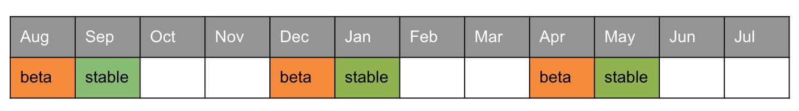
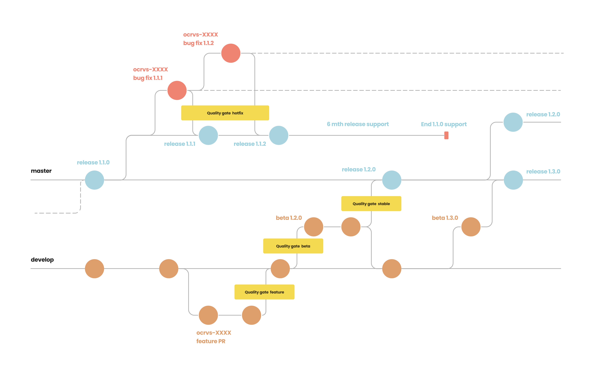
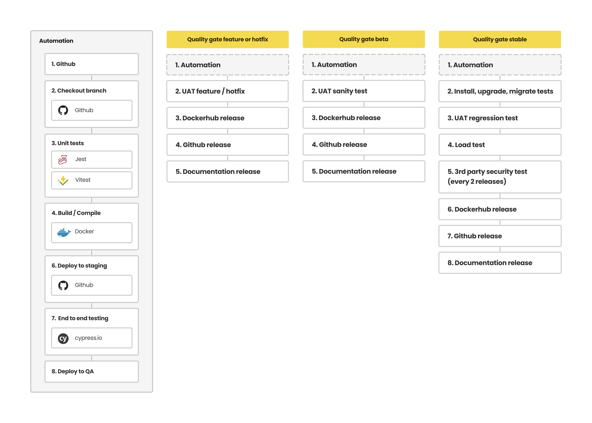

# Releases

### **OpenCRVS Release Calendar**

The OpenCRVS Core team issue product releases once every 4 months with each release receiving 6 months of bug fix (hot-fix) support.

<figure><figcaption></figcaption></figure>

### **OpenCRVS Semantic Versioning**

| Version label                | Version number              | Description                                                                                                                                                                                                                                                                    | QA strategy                                                                                                                                                                                                                                                              | Frequency      | Supported for                |
| ---------------------------- | --------------------------- | ------------------------------------------------------------------------------------------------------------------------------------------------------------------------------------------------------------------------------------------------------------------------------ | ------------------------------------------------------------------------------------------------------------------------------------------------------------------------------------------------------------------------------------------------------------------------ | -------------- | ---------------------------- |
| Core: Major (breaking)       | n.0.0 (e.g. 2.0.0)          | 
Major architectural redesign, including significant functional and design changes. Impacts Core + Country Resource Package + Infrastructure release.
                                                                                                                 | 
Creation of new test cases for new functionality. Complete regression test. Most likely new test data generator. Data migration testing. End-to-end testing (Cypress).
                                                                                |                |                              |
| Core: Minor (breaking)       | x.n.0 (breaking) e.g. 1.2.0 | Introduces new changes which are not backward-compatible. These changes can be process related or technical.                                                                                                                                                                   | 
Creation of new test cases for new functionality. Complete regression test. Possibly changes to test data generator. Data migration testing. End-to-end testing (Cypress).
                                                                            | Every 4 months | Duration of 2 minor versions |
| Core: Minor (non-breaking)   | x.n.0 (e.g. 1.2.0)          | Introduces new backwards compatible functionality. May include data structure or other changes that are automatically migrated. SIs can safely upgrade their system to this version without implementation changes in integrations or country configuration.                   | 
Creation of new test cases for new functionality. Regression test pack to be defined. Potential changes to test data generator. End-to-end testing (Cypress).
                                                                                            | Every 4 months | Duration of 2 minor versions |
| Core: Hotfix                 | x.x.n (e.g. 1.2.1)          | Bug fixes or minor internal changes such as performance optimisations. Developed in parallel with a Minor Release (which requires the same fixes applied).                                                                                                                     | 
Specific tests to QA the defects. Small regression / smoke-test to ensure nothing impacted. End-to-end testing (Cypress).
                                                                                                                                   | Bi-weekly      | N/A                          |
| Dependant software component | x.x.0-n (e.g. 1.2.0-1)      | Includes country resource packages, integrations, data generators etc. indicating the core release with which they are compatible, including a patch suffix. Releases are otherwise independent of core releases and changes to these components do not affect core releasing. | 
Specific tests to QA the defects. Small regression / smoke-test to ensure nothing impacted.  In the case of Farajaland, latest compatible version is always deployed in conjunction with the core version being tested. End-to-end testing (Cypress).
 | N/A            | N/A                          |

### **OpenCRVS Gitflow and "Quality Gates"**

We follow the "[Gitflow](https://www.atlassian.com/git/tutorials/comparing-workflows/gitflow-workflow)" branching model with a "Quality Gate" concept (which defines specific quality assurance flows for features, beta releases, stable releases and hot-fixes).  It is imperative that implementers understand the concept of "Gitflow" when either contributing to core or merging in updates from the Farajaland country configuration package.

<figure><figcaption>
OpenCRVS Gitflow
</figcaption></figure>

Referring to the Gitflow and Quality Gate diagrams, you should be able to understand the following:

A "stable" release has  undergone not only automated testing but manual regression testing.

A "beta" release has only undergone automated testing

Any git hash tagged Dockerhub image is a new "feature" that has been recently merged into the active and unstable develop branch.  These images are not in an official beta or stable release but available to experimenters and the core development team nonetheless.

OWASP security penetration tests by a CREST certified 3rd party occur once every 12 months or on every major release.

<figure><figcaption>
OpenCRVS Quality Gates
</figcaption></figure>

### **OpenCRVS Upgrade Process**

The following video demonstrates the process of upgrading OpenCRVS using a real-world example where a country is upgrading a non-breaking hotfix release version.



