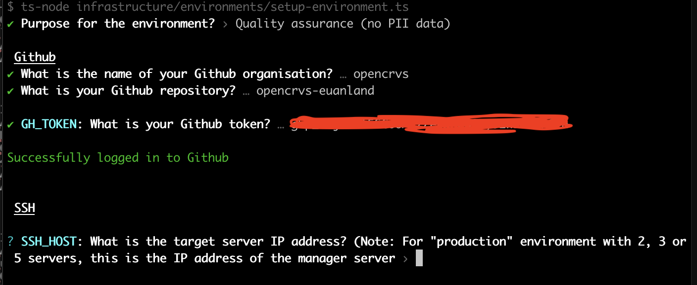

# 4.3.4 Create a Github environment

We have an automated script to generate [Github environments](https://docs.github.com/en/actions/deployment/targeting-different-environments/using-environments-for-deployment) for you along with all the application secrets that Github needs to run the continuous provisioning and deployment scripts.

The environments will be named according to the naming convention identical to that we have described [here](../).&#x20;

Specifically: **qa, staging, production,** **backup** and for training purposes a **development** (optional) server.

Github Actions use these environments to access the secret keys and configurations used when installing software on servers and deploying OpenCRVS.

Before running the script, you must prepare some secrets that the script requires.


While we would like to show you a video of this process, it involves a lot of organisation secrets.  Therefore, we have provided as many obfuscated screenshots as possible :-)


### 1. Set up an individual and an organisation account on Dockerhub

Firstly, you will need a companion container registry account.  Our scripts are hardcoded to use Dockerhub.

You will need a docker container registry [**organisation**](https://docs.docker.com/admin/organization/orgs/) account on [Dockerhub](https://hub.docker.com/) to build and push your country configuration container (image) in order to use our scripts.  An organisation is required with all of your developers (including yourself) individual accounts added to the organisation's "[members](https://docs.docker.com/admin/organization/members/)" (or teams) list, so that each developer can access the container.

This is because your full team and all the servers will need access to your forked countryconfig docker container.  The servers will use your personal Dockerhub credentials to access the container. [Dockerhub](https://hub.docker.com/) is a free containerisation repository that will provide you with 1 free private repository, and that is all you need. You will have to customise our infrastructure scripts if you wish to use a different container registry provider.

Then create an empty private repository to store your configuration...

<figure><figcaption><p>Creating a private Dockerhub repository for a countryconfig forked container</p></figcaption></figure>

Ensure that the Dockerhub members have permissions to write to the repository:

<figure><figcaption></figcaption></figure>


You will need your Dockerhub **username** and a personal Dockerhub account **access token** in order to create the Github environment.  Our scripts use these credentials to login to Dockerhub programmatically.  This is how you create a Dockerhub access token: [https://docs.docker.com/security/for-developers/access-tokens/](https://docs.docker.com/security/for-developers/access-tokens/)


### 2. Create a Github Personal Access Token

You need to create a [Github Personal Access Token ](https://docs.github.com/en/authentication/keeping-your-account-and-data-secure/managing-your-personal-access-tokens#creating-a-personal-access-token-classic)with the required permissions in order for the script to programmatically create Github environments on your forked countryconfig repository.

The only required scope for the token is "repo".


**Set the expiration as you wish.  Note that the token secret will need to be updated regularly for deployment actions to function when it expires.**


<figure><figcaption></figcaption></figure>

### 3. According to your requirements, decide your VPN approach

OpenCRVS should be installed behind a VPN.  You will need to prepare access secrets and variables for your VPN of choice.  Running this script will ask you for VPN information when provisioning a production or staging environment.  There are a few things to consider here.

You have many choices depending on your preferred way for Github Actions to access the target machine you are provisioning or deploying to.

Prepare your VPN and the Github Action approach to connect through the VPN by following the section [4.3.4.2 VPN Recipes](4.3.4.2-vpn-recipes.md).

### 4. Create companion service accounts for monitoring (optional, but recommended)

Our code is hardcoded to track bugs in [Sentry](https://www.sentry.io) and then these can be redirected to an email address or [Slack](https://slack.com/) channel.  Sentry and Slack are extremely low cost tools (all ongoing service costs are listed in section [4.3](../)). &#x20;

We can use the same email address or Slack channel to receive any uncaught errors or infrastructure monitoring alerts from Sentry as we will do from the internal Kibana monitoring tool: explained further in the [Monitoring](../../../7.-monitoring/) section.

Create a NodeJS project in Sentry for your chosen environment

<figure><figcaption><p>Creating a NodeJS, Sentry project for a "production" environment</p></figcaption></figure>

In the Sentry project settings, select "Client Keys", and **copy the DSN property**.   You will need it later.

<figure><figcaption></figcaption></figure>

If you wish to use Slack to receive Sentry and Kibana alerts you can create a dedicated Slack Channel and set up a Sentry Alert Rule like this:.

Create a [Slack integration](https://sentry.io/integrations/slack/) with Sentry.  Then you can configure an alert like this example that directs alerts to a Slack Channel called "#sentry-madagascar":

<figure><figcaption></figcaption></figure>

Any uncaught errors that are not tracked by Sentry, will be tracked by Kibana as an uncaught error.  In order to receive Kibana errors, you must set the ALERT\_EMAIL property and Kibana will email these errors to you via your SMTP service.  You can get a unique email address for a Slack Channel by clicking this button in your channel "Integrations" tab.  In this way, all your Kibana errors can direct to the same Slack channel as used by Sentry:

<figure><figcaption><p>Getting an email address for a Slack channel</p></figcaption></figure>

Sentry & Kibana alerts can be configured to be broadcast to any email address.  The benefits of using Slack, are that your entire development and quality assurance team can receive these notifications without a single individual being a gatekeeper, thus improving your processes.

### 5. Run the create github environment script to create a "qa" or "development" environment

To run the script, cd into your forked countryconfig repository and run the following command:

```
yarn environment:init
```

The script will ask you to select the type of environment that you wish to create, then it will continue to ask you enter all the relevant information for your Github repository.

<figure><figcaption></figcaption></figure>

The script will fail if it cannot connect to Github for whatever reason, then continue.

<figure><figcaption><p>The script will ask for the SSH connection details and <strong>private</strong> key for the "provision" user</p></figcaption></figure>

The script will ask for the SSH connection details and **private** key for the "provision" user and attempt to connect as the provision user to your server.  Terminal will open your default text editor such as [nano](https://www.nano-editor.org/) or [vim](https://www.vim.org/) so that you can paste in and save the key.  You should already be familiar with how to use these tools.

Normally [Vim](https://www.vim.org/) will be the default editor which opens in Linux, and you should paste in the corresponding key after you click "Enter".  After pasting in the key, you can type the following command to save & exit [Vim](https://www.vim.org/):

```
:wq!
```

The script will fail if it cannot make an SSH connection to your server for whatever reason or continue.

<figure><figcaption><p>The script allocates disk space and creates a known-hosts file for your server domain</p></figcaption></figure>

The script will ask for your Dockerhub credentials or skip if they already exist in your repository and continue to ask about encrypted diskpace and domain information.

In the above example, we set the amount of DISK\_SPACE which will be set aside for encrypted civil registration data.  In this example the total available diskspace is 250g, therefore we save 50g aside for the operating system and Docker images.

The script will ask how many replica nodes are in your server cluster, then it will automatically create a text file in your local repo: infrastructure/known-hosts used for Github SSH purposes.

<figure><figcaption></figcaption></figure>


This known-hosts file is updated each time you create a new environment.  This fie must always be committed to Git.  The Gihub Action requires access to this file in order to SSH into the environments.



<figure><figcaption></figcaption></figure>

The script will create a username and password to login to Kibana, ask if you want to use Sentry and for the Sentry DSN before creating login details for Metabase dashboards.  We recommend that you accept the defaults and save the details in your password manager.

The script will then ask you for your SMTP server details so that OpenCRVS can send automated emails to civil registration **staff**.  It will ask for your sender email address which is the **from** address in all email communications that staff will receive. This should be a real inbox that you can monitor if staff email you for technical support.

The script will then ask you for an alert email address or Slack channel link to receive alerts from Kibana.

The script will ask you to confirm the method of notification Email or SMS that **informants** will receive  status updates for vital events.  Naturally costs must be considered and the informant contact details that are asked in your event registration forms must match your choice here.

The script will then generate strong database passwords for all the database technologies used in OpenCRVS.  It will display all the secrets that the script will create and ask you if you want to continue to create the environment on Github.

<figure><figcaption></figcaption></figure>

The script will slowly create the Github environment and upload all the secrets OpenCRVS requires to provision and deploy OpenCRVS from Github Actions.

<figure><figcaption><p>The script will proceed to create the Github environment and a .env file in your local repo for reference</p></figcaption></figure>

You will notice that a file: .env.\<your environment> has been created.  This file contains all the secrets that were created.  It is essential that the contents of this file be stored safely as it contains all your passwords for accessing your server and all the data on it.

<figure><figcaption></figcaption></figure>


The .env.\<your environment> file is not required by OpenCRVS.  It simple exists for your reference.  Once you have copied the contents into a secure password manager such as [Bitwarden](https://bitwarden.com/) or [1Password](https://1password.com/), you can delete this file.  **YOU MUST NEVER SHARE THIS FILE, NOR COMMIT IT TO GIT!!!**


<figure><figcaption></figcaption></figure>

You will notice that an environment now exists in your Github repo containing all the secrets required.


If you made a mistake and wish to run the script for this environment again, you must delete the environment on Github by clicking the trash icon first. **The environment and all secrets will be deleted and recreated, enforcing you to start over.**


<figure><figcaption><p>You will also notice some "repository secrets and variables" have been created accesiblt to all environments</p></figcaption></figure>

### 6. Run the script again to create a "backup" environment


The "backup" environment must be created on Github first **before** setting up a "staging" or "production" environment where "personally identifiable information" or (PII) for citizens is stored and accessed.


You will notice far fewer questions are asked, as a backup server does not run OpenCRVS. Instead it is a basic server used for storing encrypted backups only.

The script creates a **BACKUP\_ENCRYPTION\_PASSPHRASE** which is used to encrypt all the citizen data in backup zips.  This is a therefore a very important secret to recover your data in the event of a disaster.

### 7. Run the script again to create a "staging" & "production" environment

If you are setting up a "staging" or "production" environment where "personally identifiable information" or (PII) for citizens is stored and accessed, by default the script will use the **BACKUP\_ENCRYPTION\_PASSPHRASE** in the previous step.  A production server backs up to the backup server, and a staging server restores from it on a nightly basis.

When all the environments are prepared, you should see something like this:

<figure><figcaption></figcaption></figure>

### 8. Commit the infrastructure/known-hosts file to git

As mentioned previously the known-hosts file  is updated each time you create a new environment.  This fie must always be committed to Git so do this before proceeding to the provisioning step.  The Gihub Action requires access to this file in order to SSH into the environments.

You know that your Github environments are able to connect to Dockerhub successfully when you push this file to git.

<figure><figcaption></figcaption></figure>

You will notice that whenever code is merged into a "main", "master" or "develop" branch, the "Publish image to Dockerhub" action automatically runs.  It will push a Docker image of your countryconfig repository to your Dockerhub tagged with the Githash associated with that commit.  It is this Docker image that will be deployed alongside the opencrvs-core docker images in your eventually running stack.  You can manually trigger the Dockerhub build whenever you like too by using this action.  This is explained futher in [4.3.5.2 Building, pushing & releasing your countryconfig code](../4.3.5-provisioning-servers/4.3.5.2-building-pushing-and-releasing-your-countryconfig-code.md)
