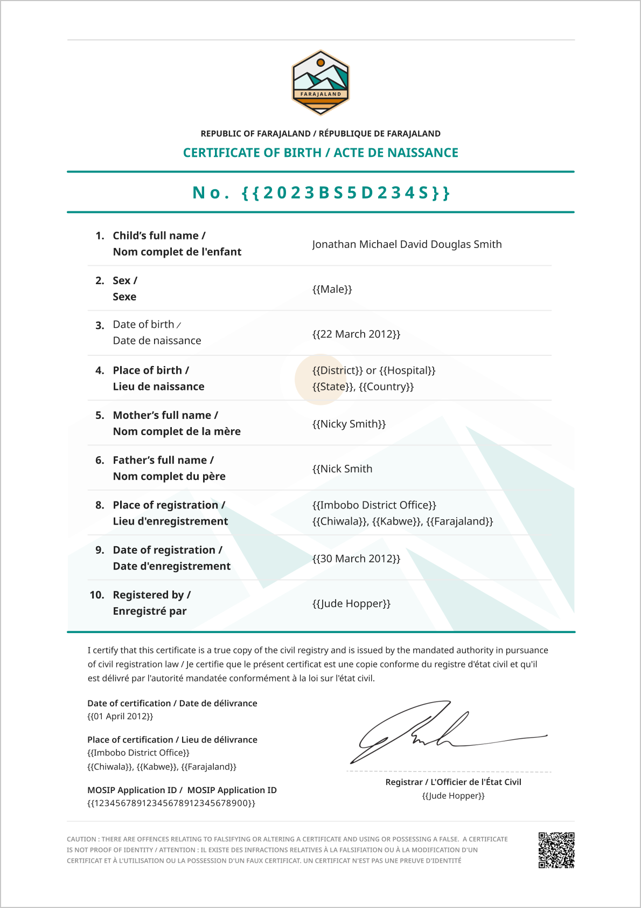
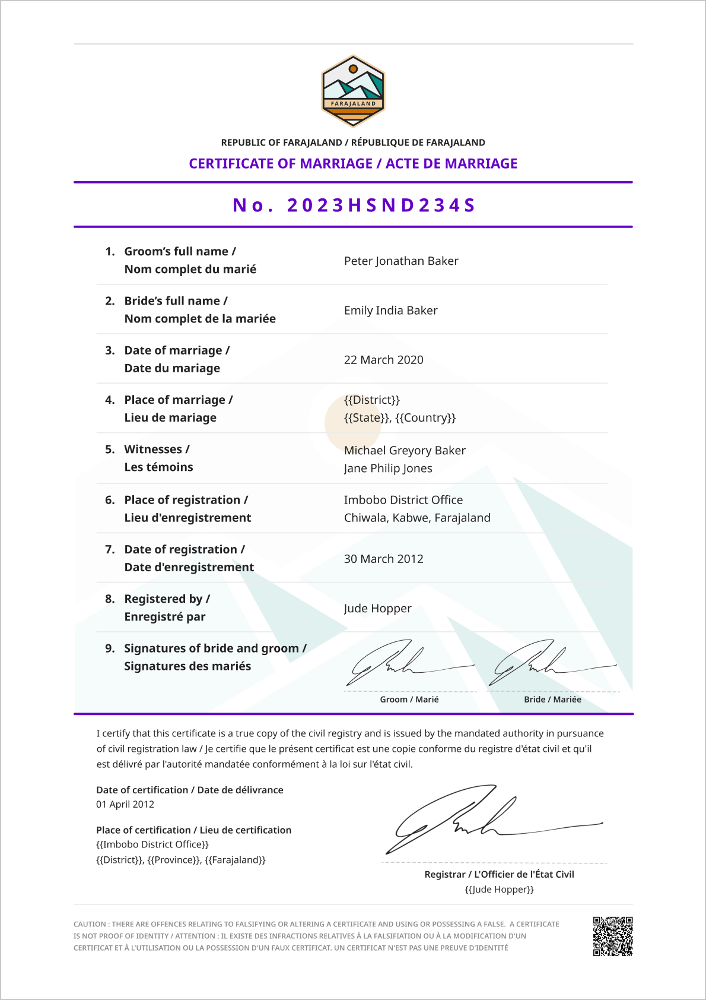

# Certified Copies templates

The following certified copies templates have been configured to support the business requirments of Farajaland.

Two types of certified copies have been configured:

* **Certificate**
  * Issued upon registration
  * Short form version of the digital record
  * Fee: Free
* **Certified Copy**
  * Can be request after the certificate has been issued.
  * Long form version of the digital record
  * Fee: $10

### Birth certificate

<figure><figcaption></figcaption></figure>

<figure><figcaption></figcaption></figure>

### Death certificate

<figure><figcaption></figcaption></figure>

<figure><figcaption></figcaption></figure>

### Marriage certificate

<figure><figcaption></figcaption></figure>

<figure><figcaption></figcaption></figure>

In the **Country Configuration Files** in the [Release Notes](../../general/v1.8-release-notes) you will find the svgs created for Farajaland certified copies
