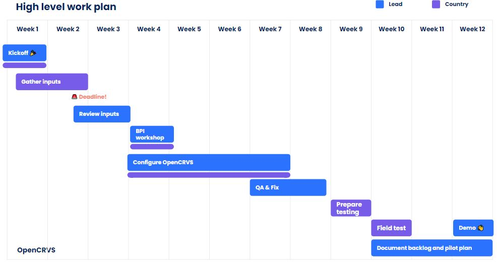

# 1. Planning an OpenCRVS Implementation


Planning an OpenCRVS Implementation


Failing to prepare is preparing to fail. Implementation planning is critical, considering the different phases of an effective digital transformation programme.

### Implementation Phases

There are 3 key phases of a digital transformation programme, and an additional pre-transformation phase that can secure buy-in and super-charge the business analysis process.&#x20;

1. **Proof of Concept:** configure the core product with basic country inputs to prove OpenCRVS’ applicability and identify additional requirements.
2. **Pilot:** test out OpenCRVS in a range of settings to prove that it works, improve the product and refine a scalable, integrated rollout plan.
3. **Scale-up: s**cale-up digital services across the country, using the integrated components tested in the pilot.&#x20;
4. **Operational Support:** Manage and maintain the solution for the long-term, including regular product upgrades and hot fixes, as required.

### Proof of Concept

OpenCRVS can be quickly configured to meet the basic civil registration needs of a country, which provides a unique opportunity to test the product and learn more about specific business needs and system requirements before procuring a full system.

The Proof of Concept (PoC) may confirm OpenCRVS as the right product for implementation or help identify the requirements that can be used within a competitive tender process.


What is a PoC and why is it valuable?


**What a PoC IS**

* Quick way to see how OpenCRVS can enable digital CRVS in your country
* Use existing functionality in the core product, applied to your country
* An opportunity to learn what works and what doesn’t work and identify additional system requirements
* Small-scale field-testing to get user feedback and better understand requirements
* An opportunity to inform the development of a long-term digitisation and investment strategy

**What a PoC IS NOT**

* A full requirements gathering process (this will happen once the country has confirmed it wants to use OpenCRVS)
* Customisation of OpenCRVS with additional requirements (no new requirements will be built)
* Live registration of vital events (only mock data will be used), so concerns about data sovereignty and ownership defined in law i.e. must host in-country, don't affect the exercise

**Outputs of a PoC**

1. **OpenCRVS Configured:** configured version of OpenCRVS for the country, hosted in the cloud.
2. **Analysis document:** including as-is and to-be process maps.
3. **Requirements backlog:** detailing all requirements identified during analysis that can be used for subsequent work. NB. this is not a complete product backlog, it is the beginning, based on findings from the PoC.
4. **Pilot plan:** enabling you to plan for a pilot of the solution to inform a national-scale CRVS digitisation effort.

<figure><figcaption>
Example PoC Work Plan
</figcaption></figure>

\

### An OpenCRVS Pilot

**Definition of a Pilot:** A pilot project is a small-scale, preliminary initiative or experiment designed to test the feasibility, viability, and effectiveness of a particular idea, concept, or solution before full-scale implementation. Pilot projects are often conducted in real-world settings to assess how a proposed intervention or innovation performs under controlled conditions and to identify any potential challenges or opportunities for improvement. These projects typically have defined objectives, timelines, and success criteria, allowing stakeholders to evaluate outcomes and make informed decisions about whether to proceed with broader implementation. Pilot projects are commonly used in various fields, including technology, healthcare, education, and social services, to validate concepts, gather feedback, and mitigate risks before investing resources in larger-scale initiatives.

NB. the purpose of a pilot is to learn and inform scale-up plans.

### Pilot Work Plan

Detailed below is an example of a work plan for a pilot of OpenCRVS in a country. You will notice that this is an **integrated** programme of work because technology alone cannot bring about a true transformation of civil registration in a country. Programme workstreams include: &#x20;

**Business Analysis:** understanding business and system requirements to help a country achieve their strategic objectives.

**Product Development & Testing:** designing, building and testing the country instance of OpenCRVS that fulfils all requirements defined through business analysis.&#x20;

**Change Management:** designing and implementing a comprehensive change management programme that will ensure effective buy-in and take-up of the new system and services.

**Training:** designing and implementing a robust training programme that equips users with the skills to effectively use the system, and that is scalable (cost-effective).&#x20;

**Monitoring & Evaluation:** defining key performance indicators (KPIs) and a continuous improvement plan that monitors these indicators on an ongoing basis in order to inform product, service and deployment improvements as the pilot ends and scale-up begins.

**Operational support:** establishing tier 0-4 user support functions to ensure that users are continuously supported over time and services remain operational.

<figure><figcaption>
Example Pilot Work Plan
</figcaption></figure>

