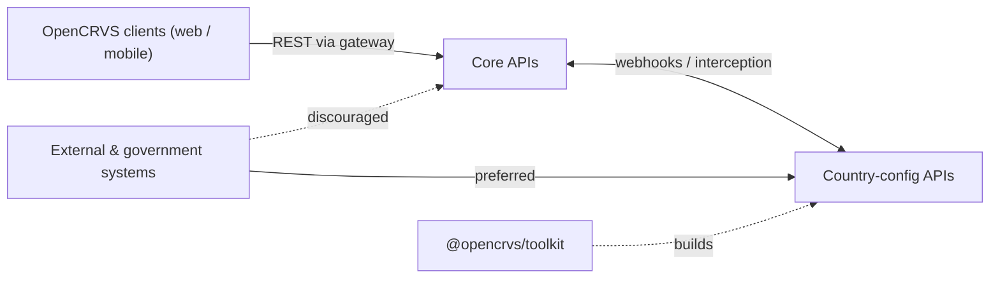

# APIs

### 1. Introduction

This page is a functional overview of the APIs OpenCRVS supports — what each one is for, who uses it, and how they fit together. It is the orientation layer above the detailed reference: each API is documented endpoint-by-endpoint in an OpenAPI specification, generated directly from the codebase and linked throughout this page.

OpenCRVS is API-first. All capabilities are exposed over **REST**, described with **OpenAPI**, so that clients, country configurations and external government systems can integrate against a stable, documented contract.

***

### 2. The API landscape

OpenCRVS exposes three distinct API families, each serving a different audience:

* **Core APIs** — exposed by OpenCRVS Core through its gateway. This is the system of record for civil registration.
* **Country-config APIs** — exposed by each country's own configuration server. This is the country's integration and policy layer, and the peer that Core calls.
* **Toolkit** — a TypeScript package (`@opencrvs/toolkit`) that is the developer-facing API for _building_ a country configuration. It is a code-level interface rather than an HTTP API.

***

### 3. Core APIs

The Core APIs are exposed by OpenCRVS Core through the API gateway. They are used by the OpenCRVS client applications and, where appropriate, by the country configuration server acting on a record's behalf.

| API              | What it does                                                                                                                                        | Reference                                                                                     |
| ---------------- | --------------------------------------------------------------------------------------------------------------------------------------------------- | --------------------------------------------------------------------------------------------- |
| **Events**       | Create and act on civil registration records — declare, validate, register, correct and certify. The authoritative source of truth for every event. | [Events](https://documentation.opencrvs.org/v2.0/technical/apis/core-apis/events)             |
| **Search**       | Query and list records quickly (Elasticsearch-backed), powering search screens and reporting.                                                       | [Search](https://documentation.opencrvs.org/v2.0/technical/apis/core-apis/search)             |
| **Locations**    | Read the administrative hierarchy and facilities used across records.                                                                               | [Locations](https://documentation.opencrvs.org/v2.0/technical/apis/core-apis/locations)       |
| **Integrations** | Register and manage the system clients used for system-to-system integration.                                                                       | [Integrations](https://documentation.opencrvs.org/v2.0/technical/apis/core-apis/integrations) |
| **Attachments**  | Upload and retrieve supporting documents, backed by S3-compatible storage.                                                                          | [Attachments](https://documentation.opencrvs.org/v2.0/technical/apis/core-apis/attachments)   |
| **Models**       | The shared data models and schemas referenced by the other Core APIs.                                                                               | [Models](https://documentation.opencrvs.org/v2.0/technical/apis/core-apis/models)             |

The full specification is published as the [Core OpenAPI spec](https://documentation.opencrvs.org/v2.0/technical/apis/core-apis).

***

### 4. Country-config APIs

Core is country-agnostic, so country-specific behaviour lives in a configuration server that each country owns and runs. The Country-config APIs are the endpoints that server exposes. Core calls them on every meaningful event — to deliver notifications and to intercept, approve or reject registration actions — and they double as the country's stable contract for any external system that needs to integrate (see section 6).

| API        | What it does                                                                                                                                                | Reference                                                                                   |
| ---------- | ----------------------------------------------------------------------------------------------------------------------------------------------------------- | ------------------------------------------------------------------------------------------- |
| **Events** | The endpoints your country configuration exposes for Core to call on each event: sending notifications, and intercepting actions to approve or reject them. | [Events](https://documentation.opencrvs.org/v2.0/technical/apis/country-config-apis/events) |
| **Models** | The shared schemas for country-configuration payloads.                                                                                                      | [Models](https://documentation.opencrvs.org/v2.0/technical/apis/country-config-apis/models) |

The full specification is published as the [Country-config OpenAPI spec](https://documentation.opencrvs.org/v2.0/technical/apis/country-config-apis).

***

### 5. Toolkit

The [`@opencrvs/toolkit`](https://documentation.opencrvs.org/v2.0/technical/apis/toolkit) package is the primary dependency for building a country configuration. Rather than an HTTP API, it provides typed TypeScript builders and helpers, so that configuration is written in code and validated at compile time.

| Module            | What it does                                                                                                | Reference                                                                                                                                                                                                       |
| ----------------- | ----------------------------------------------------------------------------------------------------------- | --------------------------------------------------------------------------------------------------------------------------------------------------------------------------------------------------------------- |
| **Configuration** | Typed builders for defining events and forms, including advanced search configuration.                      | [Configuration](https://documentation.opencrvs.org/v2.0/technical/apis/toolkit/configuration) · [Advanced search](https://documentation.opencrvs.org/v2.0/technical/apis/toolkit/configuration/advanced-search) |
| **Conditionals**  | Builders that return JSONSchema for field and action conditionals; combine them with `and`, `or` and `not`. | [Conditionals](https://documentation.opencrvs.org/v2.0/technical/apis/toolkit/conditionals)                                                                                                                     |
| **Deduplication** | Builders for defining duplicate-detection rules.                                                            | [Deduplication](https://documentation.opencrvs.org/v2.0/technical/apis/toolkit/deduplication)                                                                                                                   |
| **API Client**    | A typed client for calling the Core APIs from your country configuration.                                   | [API Client](https://documentation.opencrvs.org/v2.0/technical/apis/toolkit/api-client)                                                                                                                         |


**Match the version.** The toolkit version must match your OpenCRVS Core version exactly — for OpenCRVS 2.0.0, install `@opencrvs/toolkit@2.0.0`. When upgrading, upgrade the toolkit first so configuration breaking changes surface at compile time.


***

### 6. Integrating with OpenCRVS


**Integrate through country config, not Core directly.** External and government systems should route through the Country-config APIs rather than calling the Core APIs directly. Country config is the country's trust and policy boundary — it owns authorisation, audit and data-shaping, and it insulates integrators from changes to Core's internal APIs.


Requests are authenticated in one of two ways:

* **User JWT** — a token representing a signed-in user. The request is performed as that user, with that user's permissions. Appropriate when acting on behalf of a specific human action.
* **System client token** — a service-to-service token issued for a registered system client. Appropriate for background jobs and any flow with no human user in the loop.

Tokens are signed with RS256, and the matching public key is published at the `/.well-known` endpoint so downstream services can verify them without sharing secrets.

***

### 7. Standards and versioning

The Core and Country-config APIs are **REST** and described with **OpenAPI**; the specifications are generated automatically from the codebase, so they stay in step with the running system.

Releases follow semantic versioning (`MAJOR.MINOR.PATCH`). Patch releases are always backwards-compatible. Minor releases may change country-config contracts but never require a data migration; data migrations are reserved for major releases. For the full list of standards the platform conforms to, see the [Standards](https://documentation.opencrvs.org/v2.0/technical/architecture/standards) page.

***

### 8. Resources and support

* [Core OpenAPI spec](https://documentation.opencrvs.org/v2.0/technical/apis/core-apis) — Events, Search, Locations, Integrations, Attachments, Models.
* [Country-config OpenAPI spec](https://documentation.opencrvs.org/v2.0/technical/apis/country-config-apis) — Events, Models.
* [Toolkit](https://documentation.opencrvs.org/v2.0/technical/apis/toolkit) — Configuration, Conditionals, Deduplication, API Client.
* [Integration architecture](https://documentation.opencrvs.org/v2.0/technical/architecture/integration-architecture) — how Core and country config communicate.
