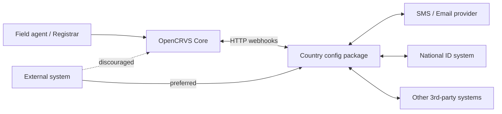
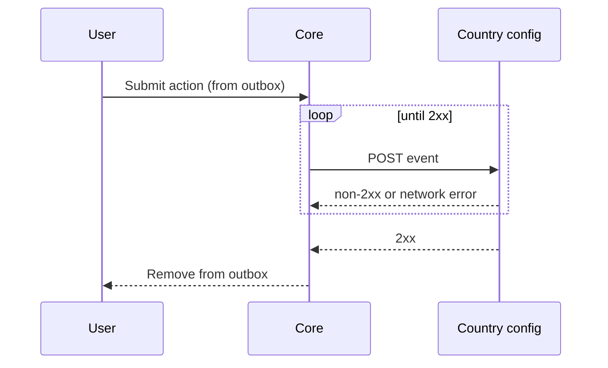
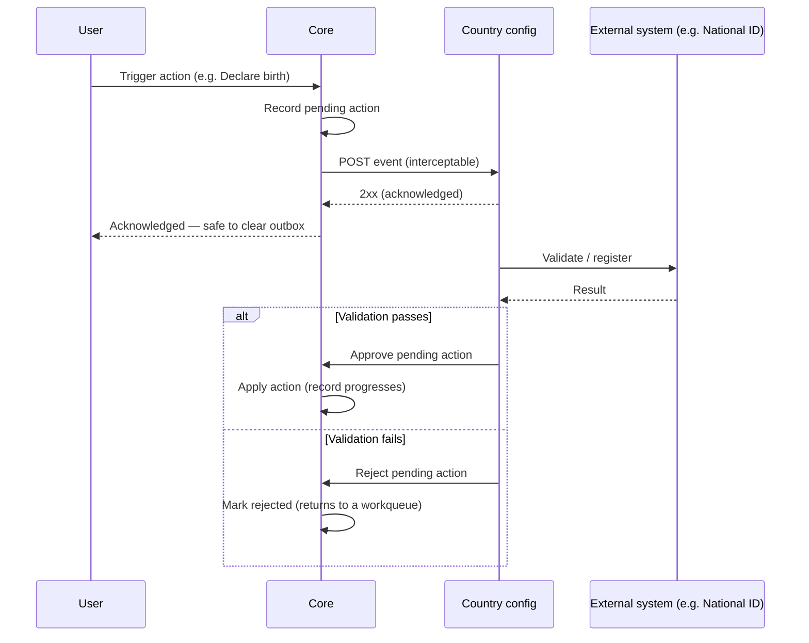
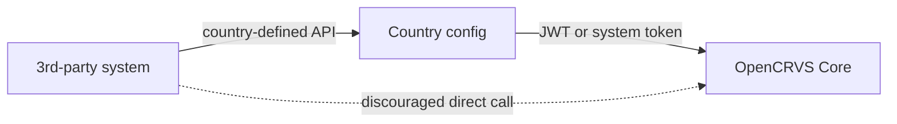

# Integration architecture

This page describes how OpenCRVS Core integrates with the outside world. It is aimed at country implementers who will build and maintain the **country configuration package** — the single point of extension and integration between Core and everything else.

### Overview

OpenCRVS Core is designed to be country-agnostic. It does not know how a country sends SMS, which National ID system it uses, or what business rules apply when a birth is declared. Instead, Core is built to communicate with **one well-known peer**: the country configuration package (referred to here as _country config_).

Country config is owned, maintained and customised by each country. It is the bridge between Core and:

* Notification providers (SMS, email)
* National ID and other government registries
* Payment providers
* Reporting and statistics systems
* Any other third-party system the country needs to integrate with

> **Golden rule:** third-party systems should never call OpenCRVS Core APIs directly. They should always go through country config, which acts as the country's integration and policy layer.

### How Core talks to country config

For every meaningful event that happens inside Core, Core sends an HTTP request to country config. This covers two broad categories:

#### 1. Notification and account events

These are events where country config is given the opportunity to **act on behalf of the country** without changing the outcome of the event in Core. Examples include:

* A user requests login and a 2FA code needs to be delivered
* A user is created and needs to receive credentials
* A registrar action needs to trigger an outbound notification

Core does not know how to send an SMS or email. It simply emits the event to country config, and country config decides whether to send the code via SMS, email, a national notification gateway, or something else entirely.

#### 2. Action triggers (interceptable events)

These are events tied to the lifecycle of a record — for example, _birth declared_, _birth registered_, _death certified_. Country config may **intercept** these events, perform additional work (such as validating against a National ID database), and then approve or reject the original action. See [#action-interception](integration-architecture.md#action-interception "mention") below.

### Webhook reliability

Integrations across government systems are rarely perfectly available, so Core treats every outbound call to country config as a request that **must eventually succeed**.

* Core retries the request to country config until it receives a `2xx` response. Any other status code, or a network error, is treated as a transient failure and retried.
* For requests originating from a user action in the UI, the request **does not leave the user's outbox** until Core has fully processed the event end-to-end. This means a field agent working offline, or one whose request is blocked behind a slow integration, will see the action remain in their outbox until it is durably accepted.
* Country config endpoints should therefore be designed to be **idempotent**. Country config may receive the same event more than once and must produce the same outcome.

### Action interception

Some events — typically registration-lifecycle actions — can be intercepted by country config. Interception lets a country attach domain-specific validation or processing to an action without modifying Core.

When Core dispatches an interceptable event, the action is recorded in Core as a **pending action** and held there until country config resolves it. While pending:

* The action exists in Core but its effects are not yet applied
* Core continues to be the source of truth for the action's state
* Country config may take as long as it needs to coordinate with external systems

Once country config acknowledges the event with a `2xx`, Core informs the user that the action has been safely received by the backend. From the user's point of view the submission is done — their outbox can clear. Whether and when the record reappears in a workqueue depends on how country config eventually resolves the pending action:

* **Approve** — the action's effects are applied and the record moves forward in its lifecycle.
* **Reject** — the action is marked rejected and the record returns to an appropriate workqueue for follow-up.

This pattern lets countries plug arbitrary business logic and external dependencies into the registration lifecycle without forking Core.

### Country config calling back into Core

Country config frequently needs to read or write data in Core — for example, to enrich a record before approving it, or to fetch contextual information before sending a notification. It does this through Core's standard APIs, authenticated in one of two ways:

* **User JWT** — country config reuses the JWT of the human user who triggered the original event. The call is performed _as that user_, with that user's permissions. This is appropriate when country config is acting on behalf of a specific human action.
* **System client token** — a service-to-service token issued through the OpenCRVS admin UI for a registered system client. This is appropriate for background work, scheduled jobs, or any flow where no human user is in the loop.

### Why third parties should not call Core directly

Country config is more than a webhook receiver — it is the **trust and policy boundary** for the country's deployment of OpenCRVS. Several things follow from this:

* **Security boundary.** Core is designed to be generic and country-neutral. Country-specific authorization, allow-listing, audit, and data-shaping decisions belong in country config. Letting third parties hit Core directly bypasses all of that.
* **Single integration surface.** When all external systems route through country config, the country has one place to upgrade contracts, swap providers, add logging, or respond to incidents.
* **Decoupling from Core upgrades.** Core's internal APIs evolve. Country config insulates third parties from those changes by exposing a stable, country-owned contract.
* **Consistent behaviour with interception.** Many third-party interactions correspond to interceptable events. Routing them through country config keeps the approve/reject lifecycle coherent.

Even when a third party needs to read Core data, the recommended pattern is to expose a country-config endpoint that fetches from Core (using a system client token) and returns a shaped, authorized response.

### Summary

* Core's only integration peer is country config.
* Every Core-side event is dispatched to country config over HTTP, with retries until a `2xx` response is received; user-originated actions stay in the outbox until fully processed.
* Country config can extend behaviour (notifications, account events) and intercept registration actions, holding them as pending in Core until approved or rejected.
* Country config calls Core using either the originating user's JWT or a system client token.
* Third parties should always integrate through country config, never directly with Core.

