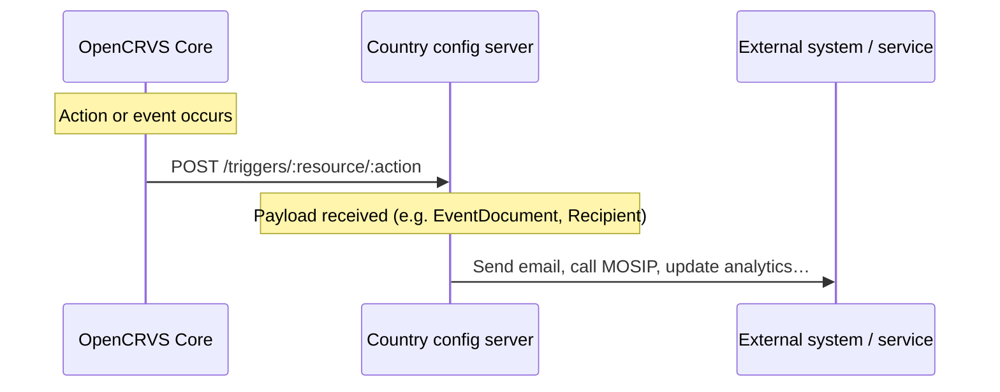

# Action triggers

**Action triggers** are the primary way to listen for events happening inside OpenCRVS core — for example, a birth declaration, a new event being created, or a user being created. Technically, action triggers are HTTP endpoints implemented by the country config server that OpenCRVS core calls when an action occurs.

Action triggers can be used for a variety of purposes, such as:

* Collecting birth registration data into an analytics system
* Sending the birth informant an email when a birth is registered
* Integrating with third-party systems — for instance, requesting a UIN from MOSIP or submitting death information to a social protection system

> **Note:** Starting from OpenCRVS 2.0, the country config package is responsible for sending all email and SMS messages.

Every trigger request targets a path following the schema `/triggers/:resource/:action` (e.g. `/triggers/user/user-updated`). For resources with subresources — such as events containing actions — the schema is `/triggers/:resource/:subresource/:action` (e.g. `/triggers/events/birth/actions/REGISTER`). All requests use the `POST` method and include a payload.

All user-specific triggers include a `Recipient` object in the payload, describing the contact details of the user to whom the message should be sent.

| Path                                                  | Payload                                                                                                                                | Triggered when                                                                                                                                  |
| ----------------------------------------------------- | -------------------------------------------------------------------------------------------------------------------------------------- | ----------------------------------------------------------------------------------------------------------------------------------------------- |
| `/triggers/events/${eventType}/actions/${actionType}` | `EventDocument`                                                                                                                        | An action for an event is **requested** but not yet approved. Country config can use this trigger to intercept and approve or reject an action. |
| `/triggers/system/ready`                              | N/A                                                                                                                                    | System seeding is completed.                                                                                                                    |
| `/triggers/user/user-created`                         | `{ recipient: Recipient, username: z.string(), temporaryPassword: z.string() }`                                                        | A new user is created. Use this to send login details to the newly created user.                                                                |
| `/triggers/user/user-updated`                         | `{ recipient: Recipient, oldUsername: z.string(), newUsername: z.string() }`                                                           | A user's username is changed. Use this to send the new username to the user — for example, when a legal name change requires a new username.    |
| `/triggers/user/username-reminder`                    | `{ recipient: Recipient, username: z.string() }`                                                                                       | A user requests a username reminder during the authentication process.                                                                          |
| `/triggers/user/reset-password`                       | `{ recipient: Recipient, code: z.string() }`                                                                                           | A user requests a password reset during the authentication process.                                                                             |
| `/triggers/user/reset-password-by-admin`              | `{ recipient: Recipient, temporaryPassword: z.string(), admin: z.object({ id: z.string(), name: NameFieldValue, role: z.string() }) }` | An admin resets a user's password.                                                                                                              |
| `/triggers/user/2fa`                                  | `{ recipient: Recipient, code: z.string() }`                                                                                           | A user authenticates with 2FA enabled. Use this to deliver the 2FA code — for example, via email.                                               |
| `/triggers/user/all-user-notification`                | `{ recipient: Recipient, subject: z.string(), body: z.string() }`                                                                      | An admin sends an all-user notification — for example, ahead of a scheduled system upgrade.                                                     |
| `/triggers/user/change-phone-number`                  | `{ recipient: Recipient, code: z.string() }`                                                                                           | A user changes their phone number in profile settings. Use this to send a verification code to their registered email address.                  |
| `/triggers/user/change-email-address`                 | `{ recipient: Recipient, code: z.string() }`                                                                                           | A user changes their email address in profile settings. Use this to send a verification code to their previously registered email address.      |
