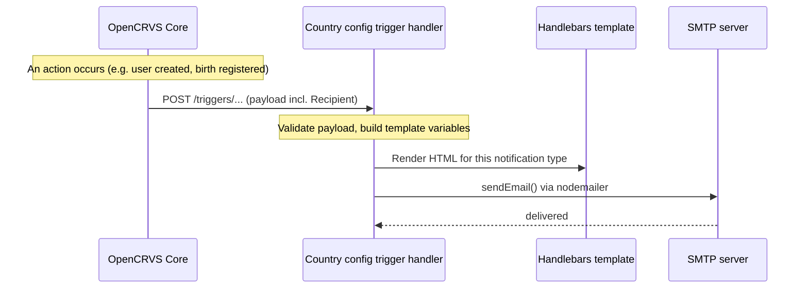

# Email notifications

## Email notifications

From OpenCRVS 2.0, the **country config server is responsible for sending all email and SMS messages**. OpenCRVS Core never talks to an email provider directly — instead it calls action triggers on your country config server, and your country config decides whether and how to turn each trigger into a message.

This guide explains how email delivery is implemented in the reference country config (`opencrvs-countryconfig`), how to configure it, and how to customise the messages. All paths below are in the `opencrvs-countryconfig` repository unless stated otherwise.

There are two families of email notifications:

* **User notifications** — account and authentication lifecycle (onboarding, password reset, 2FA, username reminders, all-user broadcasts). Triggered by Core via `/triggers/user/...`.
* **Informant notifications** — event lifecycle (a declaration is started, sent for review, registered, or rejected). Triggered by Core via the event action trigger.

Both families converge on the same email service, so the SMTP configuration and email-sending behaviour described here apply to all of them.

***

#### 1. How an email is sent



The implementation lives in `src/api/notification/`:

| File                       | Responsibility                                                                   |
| -------------------------- | -------------------------------------------------------------------------------- |
| `handler.ts`               | Trigger handlers; `notify()` chooses email vs SMS and renders the template.      |
| `email-service.ts`         | `sendEmail()` — builds the nodemailer transport and sends the message.           |
| `email-templates/index.ts` | Maps each notification type to a template file, subject, and expected variables. |
| `informantNotification.ts` | Builds informant (event) notifications from an `EventDocument`.                  |
| `constant.ts`              | Reads the SMTP and notification environment variables.                           |

***

#### 2. SMTP configuration

Email delivery is configured entirely through environment variables on the country config server (`src/api/notification/constant.ts`):

| Variable               | Default | Purpose                                          |
| ---------------------- | ------- | ------------------------------------------------ |
| `SMTP_HOST`            | —       | SMTP server hostname.                            |
| `SMTP_PORT`            | `587`   | SMTP server port.                                |
| `SMTP_SECURE`          | `false` | Set to `true` to use an implicit TLS connection. |
| `SMTP_USERNAME`        | —       | SMTP authentication user.                        |
| `SMTP_PASSWORD`        | —       | SMTP authentication password.                    |
| `SENDER_EMAIL_ADDRESS` | —       | The `From` address used for all outgoing mail.   |

Two further variables are used inside templates and operational mail: `DOMAIN` (your installation's domain) and `ALERT_EMAIL` (where infrastructure alerts are forwarded). `LOGIN_URL` is used to build onboarding and password-setup links.

In deployed environments the SMTP secrets are provided as deployment secrets rather than committed to the repository.

***

#### 3. Choosing the delivery method

Whether a notification family is delivered by email, by SMS, or not at all is controlled in `src/api/application/application-config.ts`:

| Setting                                  | Values                       | Applies to                           |
| ---------------------------------------- | ---------------------------- | ------------------------------------ |
| `USER_NOTIFICATION_DELIVERY_METHOD`      | `'email'` \| `'sms'` \| `''` | User / authentication notifications. |
| `INFORMANT_NOTIFICATION_DELIVERY_METHOD` | `'email'` \| `'sms'` \| `''` | Informant / event notifications.     |

Set a value to `'email'` to send email, `'sms'` to send via the SMS service (Infobip in the reference config), or `''` (empty) to disable that family entirely. If `email` is selected but a recipient has no email address, the notification is skipped and the reason is logged.


`all-user-notification` cannot be delivered over SMS — if `USER_NOTIFICATION_DELIVERY_METHOD` is `'sms'`, all-user broadcasts are skipped.


***

#### 4. Email templates

Templates are **Handlebars** HTML files under `src/api/notification/email-templates/`, organised by event type:

```
email-templates/
├── birth/      inProgress · inReview · registration · rejection
├── death/      inProgress · inReview · registration · rejection
├── marriage/   inProgress · inReview · registration · rejection
└── other/      onboarding-invite · 2-factor-authentication · password-reset · …
```

`email-templates/index.ts` binds each notification type to a template file and a default subject, and declares the variables that template receives. Every template can use these globally available variables (resolved in `email-service.ts`): `DOMAIN`, `ALERT_EMAIL`, and `SENDER_EMAIL_ADDRESS`. Each template additionally receives `applicationName`, `countryLogo`, and its own type-specific variables.

**4.1 User notification templates**

| Trigger                   | Template (`other/`)                   | Default subject                            |
| ------------------------- | ------------------------------------- | ------------------------------------------ |
| `user-created`            | `onboarding-invite.html`              | Welcome to OpenCRVS!                       |
| `resend-invite`           | `resend-invite.html`                  | Your OpenCRVS account invitation           |
| `user-updated`            | `username-updated.html`               | Account username updated                   |
| `username-reminder`       | `username-reminder.html`              | Account username reminder                  |
| `reset-password`          | `password-reset.html`                 | Account password reset request             |
| `reset-password-by-admin` | `password-reset-by-system-admin.html` | Account password reset invitation          |
| `2fa`                     | `2-factor-authentication.html`        | Two factor authentication                  |
| `change-phone-number`     | `change-phone-number.html`            | Phone number change request                |
| `change-email-address`    | `change-email-address.html`           | Email address change request               |
| `all-user-notification`   | `all-user-notification.html`          | _(set by the admin sending the broadcast)_ |

See the action triggers reference for the exact payload of each `/triggers/user/...` endpoint.

**4.2 Informant notification templates**

For each event type, the informant template is chosen from the pending action on the event:

| Action     | Template            | Default subject (birth)           |
| ---------- | ------------------- | --------------------------------- |
| `NOTIFY`   | `inProgress.html`   | Birth declaration in progress     |
| `DECLARE`  | `inReview.html`     | Birth declaration in review       |
| `REGISTER` | `registration.html` | Birth declaration registered      |
| `REJECT`   | `rejection.html`    | Birth declaration required update |

Informant templates receive `trackingId`, `crvsOffice`, `registrationLocation`, `informantName`, `name` (the subject of the event), and — for registration — `registrationNumber`.

***

#### 5. Informant notifications in detail

When an event action is requested, Core calls the event action trigger on country config. The reference config wires this to `onAnyActionHandler` (`src/api/events/handler.ts`), which calls `sendInformantNotification()`:

1. The pending action and the aggregated declaration are read from the `EventDocument`.
2. The recipient is resolved from the declaration — `informant.email` and `informant.phoneNo`, with the name taken from the mother/father/informant (birth) or spouse/informant (death).
3. The action type selects the template (see §4.2).
4. `notify()` renders the template and sends it using the informant delivery method.

Because the recipient's contact details come from the declaration, informant emails only go out when the informant provided an email address and `INFORMANT_NOTIFICATION_DELIVERY_METHOD` is `'email'`.

***

#### 6. Customising emails

* **Change wording or branding** — edit the relevant `.html` file under `email-templates/`. Templates are Handlebars, so you can use `{{variable}}` placeholders for any variable that template receives.
* **Change a subject line** — edit the `subject` for that notification type in `email-templates/index.ts`.
* **Add a new global variable** — register it in the `replaceVariables` map in `email-service.ts` so it resolves in every template's `from`, `to`, `subject`, and `html`.
* **Switch a family to SMS or disable it** — change `USER_NOTIFICATION_DELIVERY_METHOD` / `INFORMANT_NOTIFICATION_DELIVERY_METHOD` in `application-config.ts`.
* **Send entirely custom messages** — implement your own logic in the trigger handlers; the trigger payloads (see action triggers) give you everything Core knows about the event or user.

***

#### 7. Behaviour in development and testing

A few safeguards prevent accidental sends in non-production environments. Keep these in mind when testing:

* Emails are only sent when `NODE_ENV` is `production`. The `/email` handler short-circuits with a `200` (and logs the payload) when `NODE_ENV` is not `production`, and `notify()` logs to the console instead of sending when `NODE_ENV` is `development`.
* Any recipient address ending in `@example.com` is skipped — the seeded demo users (e.g. Farajaland) use `@example.com` addresses, so they never receive real mail.
