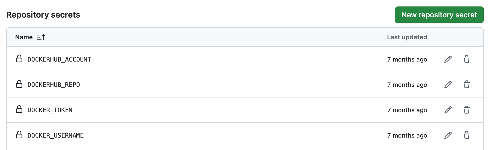

# Forking the repos

The first step towards maintaining your own country configuration is to fork the OpenCRVS [country configuration](https://github.com/opencrvs/opencrvs-countryconfig) repo on GitHub, which is based on the demonstration country **Farajaland**.

You can then commit all changes to this repo and build your countryconfig Docker image using the built in Github Actions and [**Dockerhub**](https://hub.docker.com/) account.


#### 1. Use a GitHub Organisation

The country configuration repository should be forked into a **GitHub Organisation**, not a personal GitHub account.

Your organisation should:

* use a **GitHub Team** or **Enterprise** plan (required for branch protection rules and Github Actions minutes)
* grant you **Administrator** permissions on the repository

Using an organisation simplifies collaboration, governance and access management throughout the lifetime of the project.

#### 2. Choose a repository name

Rename the repo to represent your own country implementation. E.G.

```
opencrvs-<country-name>
```

#### 3. Plan your branching strategy

We recommend adopting a Gitflow-style branching strategy to separate development, testing and production releases.

| Branch               | Purpose                   |
| -------------------- | ------------------------- |
| `main` (or `master`) | Deployment configuration  |
| `develop`            | Development configuration |

This allows configuration changes to be developed independently, tested in the `develop` branch and promoted to `main` only when approved.

#### 4. Define repository governance

Before development begins, configure your repository permissions.

This typically includes:

* adding implementation team members
* assigning code reviewers
* identifying repository administrators
* granting DevOps engineers appropriate deployment permissions

#### 5. Configure branch protection

To protect your production configuration and enforce code review, configure branch protection rules for your repository.

Navigate to:

**Settings → Branches → Add Branch Protection Rule**

Create a protection rule for the `main` branch (and optionally `develop`) with the following recommended settings:

* Require pull request reviews before merging
* Require status checks to pass before merging (when CI is configured)
* Require signed commits (recommended)
* Restrict who can push directly to protected branches

Once configured, test the protection rules by creating and merging a test pull request.

Branch protection helps ensure that all configuration changes are reviewed, validated and traceable before they are deployed.

#### 6. Set up an individual and an organisation account on Dockerhub <a href="#id-1.-set-up-an-individual-and-an-organisation-account-on-dockerhub" id="id-1.-set-up-an-individual-and-an-organisation-account-on-dockerhub"></a>

You will also need a container registry to store your country configuration Docker image. OpenCRVS is configured to use **Docker Hub** by default, although you can modify the infrastructure to use another container registry if preferred.

Create a **Docker Hub Organisation** and add all developers as members so they can publish and access images. Then create a **single private repository** to store your country configuration image. This repository will be accessed by both your development team and your OpenCRVS servers during deployment.

Docker Hub's free plan includes one private repository, which is sufficient for a typical OpenCRVS implementation.

Creating a private Dockerhub repository for a countryconfig forked container:

<figure><figcaption></figcaption></figure>

Ensure that the Dockerhub members have permissions to write to the repository:

<figure><figcaption></figcaption></figure>

You will need your Dockerhub **username** and a personal Dockerhub account **access token**. Our scripts use these credentials to login to Dockerhub programmatically. This is how you create a Dockerhub access token: [https://docs.docker.com/security/for-developers/access-tokens/](https://docs.docker.com/security/for-developers/access-tokens/)

#### 7. Ensure your Docker image can be built successfully

When you merge any pull request into the "main", "master" or "develop" branch, or if you explicitly run the "Publish image to Dockerhub" Gthub Action, a docker container image will be built and pushed to Dockerhub for your **countryconfig** microservice.

In [Github repository secrets](https://docs.github.com/en/actions/how-tos/write-workflows/choose-what-workflows-do/use-secrets), set the following values and the above will occur.

<figure><figcaption></figcaption></figure>
