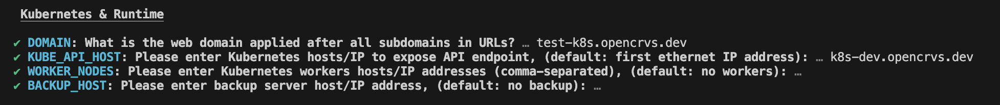

# 4.3.1 Create a Github environment

We have an automated script to generate [Github environments](https://docs.github.com/en/actions/deployment/targeting-different-environments/using-environments-for-deployment) for you along with all the application secrets that Github needs to run the continuous provisioning and deployment scripts.

Environment naming is not limited, but recommended to use naming convention described at [here](../).

Specifically: **qa, staging, production,** **backup** and for training purposes a **development** (optional) server.

Github Actions use these environments to access the secret keys and configurations used when installing software on servers and deploying OpenCRVS.

Before running the script, you must prepare some secrets that the script requires.


While we would like to show you a video of this process, it involves a lot of organisation secrets. Therefore, we have provided as many obfuscated screenshots as possible :-)


### 1. Set up an individual and an organisation account on Dockerhub


Dockerhub account is required by two repositories:
- Countryconfig template: Push custom docker image with your country configuration
- Infrastructure: Pull pushed image on your server environment



Firstly, you will need a companion container registry account. Our scripts are hardcoded to use Dockerhub, if you need to work with any other private registry, please modify provision and deploy scripts.

You will need a docker container registry [**organisation**](https://docs.docker.com/admin/organization/orgs/) account on [Dockerhub](https://hub.docker.com/) to build and push your country configuration container (image) in order to use our scripts. An organisation is required with all of your developers (including yourself) individual accounts added to the organisation's "[members](https://docs.docker.com/admin/organization/members/)" (or teams) list, so that each developer can access the container.

This is because your full team and all the servers will need access to your forked countryconfig docker container. The servers will use your personal Dockerhub credentials to access the container. [Dockerhub](https://hub.docker.com/) is a free containerisation repository that will provide you with 1 free private repository, and that is all you need. You will have to customise our infrastructure scripts if you wish to use a different container registry provider.

Then create an empty private repository to store your configuration...

<figure><figcaption><p>Creating a private Dockerhub repository for a countryconfig forked container</p></figcaption></figure>

Ensure that the Dockerhub members have permissions to write to the repository:

<figure><figcaption></figcaption></figure>


You will need your Dockerhub **username** and a personal Dockerhub account **access tokens** in order to create the Github environment. Our scripts use these credentials to login to Dockerhub programmatically. This is how you create a Dockerhub access token: [https://docs.docker.com/security/for-developers/access-tokens/](https://docs.docker.com/security/for-developers/access-tokens/)


### 2. Create a Github Personal Access Token

You need to create a [Github Personal Access Token ](https://docs.github.com/en/authentication/keeping-your-account-and-data-secure/managing-your-personal-access-tokens#creating-a-personal-access-token-classic)with the required permissions in order for the script to programmatically create Github environments on your forked countryconfig repository.

The only required scope for the token is "repo".


**Set the expiration as you wish. Note that the token secret will need to be updated regularly for deployment actions to function when it expires.**


<figure><figcaption></figcaption></figure>

### 3. Create companion service accounts for monitoring (optional, but recommended)

Our code is hardcoded to track bugs in [Sentry](https://www.sentry.io) and then these can be redirected to an email address or [Slack](https://slack.com/) channel. Sentry and Slack are extremely low cost tools (all ongoing service costs are listed in section [4.3](../)).

We can use the same email address or Slack channel to receive any uncaught errors or infrastructure monitoring alerts from Sentry as we will do from the internal Kibana monitoring tool: explained further in the [Monitoring](../../../../../v1.8.0/setup/7.-monitoring) section.

Create a NodeJS project in Sentry for your chosen environment

<figure><figcaption><p>Creating a NodeJS, Sentry project for a "production" environment</p></figcaption></figure>

In the Sentry project settings, select "Client Keys", and **copy the DSN property**. You will need it later.

<figure><figcaption></figcaption></figure>

If you wish to use Slack to receive Sentry and Kibana alerts you can create a dedicated Slack Channel and set up a Sentry Alert Rule like this:.

Create a [Slack integration](https://sentry.io/integrations/slack/) with Sentry. Then you can configure an alert like this example that directs alerts to a Slack Channel called "#sentry-madagascar":

<figure><figcaption></figcaption></figure>

Any uncaught errors that are not tracked by Sentry, will be tracked by Kibana as an uncaught error. In order to receive Kibana errors, you must set the `ALERT_EMAIL` GitHub secret and Kibana will email these errors to you via your SMTP service. You can get a unique email address for a Slack Channel by clicking this button in your channel "Integrations" tab. In this way, all your Kibana errors can direct to the same Slack channel as used by Sentry:

<figure><figcaption><p>Getting an email address for a Slack channel</p></figcaption></figure>

Sentry & Kibana alerts can be configured to be broadcast to any email address. The benefits of using Slack, are that your entire development and quality assurance team can receive these notifications without a single individual being a gatekeeper, thus improving your processes.

### 5. Run the create github environment script to create a "qa" and (or) "development" environment

To run the script, cd into your forked infrastructure repository and run the following command:

```
yarn environment:init
```



Please install yarn dependencies before running first time:
```
yarn install
```



The script will ask you to select the type of environment that you wish to create, then it will continue to ask you enter all the relevant information for your Github repository.


The script will fail if it cannot connect to Github for whatever reason, then continue.

<figure><figcaption><p>Script after login to GitHub repository</p></figcaption></figure>

The script will ask for your Dockerhub credentials or skip if they already exist.

<figure><figcaption><p>Script example if credentials already exists</p></figcaption></figure>


The script will ask you to provide Kubernetes and Runtime options:
- `DOMAIN`: Domain name to expose OpenCRVS instance
- `KUBE_API_HOST`: IP address or domain to expose Kubernetes API endpoint
- `WORKER_NODES`: Optional parameter if you are planning to setup kubernetes cluster with multiple nodes. This property could be left empty for single node setup or you can add worker nodes later.
- `BACKUP_HOST`: Backup server, define this property if you would like to manage backup server as part of your environment. Check [Backup and restore](../4.3.7-backup-and-restore/) section for more information how to use configure backup server.

<figure><figcaption><p>Kubernetes and runtime options</p></figcaption></figure>

The script will ask you to provide  Databases & monitoring options:

<figure><figcaption><p>Databases & monitoring options</p></figcaption></figure>

In the above example, we set the amount of `DISK_SPACE` which will be set aside for encrypted civil registration data. In this example the total available diskspace is 150g, therefore we save 50g aside for the operating system and Docker images.


<figure><figcaption></figcaption></figure>

The script will create a username and password to login to Kibana, ask if you want to use Sentry and for the Sentry DSN before creating login details for Metabase dashboards. We recommend that you accept the defaults and save the details in your password manager.

The script will then ask you for your SMTP server details so that OpenCRVS can send automated emails to civil registration **staff**. It will ask for your sender email address which is the **from** address in all email communications that staff will receive. This should be a real inbox that you can monitor if staff email you for technical support.

The script will then ask you for an alert email address or Slack channel link to receive alerts from Kibana.

The script will ask you to confirm the method of notification Email or SMS that **informants** will receive status updates for vital events. Naturally costs must be considered and the informant contact details that are asked in your event registration forms must match your choice here.

The script will then generate strong database passwords for all the database technologies used in OpenCRVS. It will display all the secrets that the script will create and ask you if you want to continue to create the environment on Github.

<figure><figcaption></figcaption></figure>

The script will slowly create the Github environment and upload all the secrets OpenCRVS requires to provision and deploy OpenCRVS from Github Actions.

<figure><figcaption><p>The script will proceed to create the Github environment and provide a command to bootstrap self-hosted runner on your server.</p></figcaption></figure>

On the final step the script will proceed to create the Github environment and provide a command to bootstrap self-hosted runner on your server.
Save a command from script output to temporal file, you will need it later.

Run following command on your infrastructure repository:
```
git status
```
You should get a number of files modified by `yarn environment:init` script:
```
Changes not staged for commit:
  (use "git add <file>..." to update what will be committed)
  (use "git restore <file>..." to discard changes in working directory)
        modified:   .github/workflows/deploy-dependencies.yml
        modified:   .github/workflows/deploy-opencrvs.yml
        modified:   .github/workflows/github-to-k8s-sync-env.yml
        modified:   .github/workflows/k8s-reindex.yml
        modified:   .github/workflows/k8s-reset-data.yml
        modified:   .github/workflows/k8s-seed-data.yml
        modified:   .github/workflows/provision.yml
        modified:   .github/workflows/reset-2fa.yml
Untracked files:
  (use "git add <file>..." to include in what will be committed)
        environments/development/
        infrastructure/server-setup/inventory/development.yml
```

Usually review is not required for files under `.github` folder.

Review modified files:
- `infrastructure/server-setup/inventory/<environment name>.yml`: Configuration file for ansible playbook responsible for server provision. Make sure users list was updated. For more information please follow hints inside file.
- `environments/<environment name>`: Folder with `values,yaml` files for helm charts:
   - `environments/<environment name>/traefik/values.yaml`: Update this file with proper configuration to handle SSL certificate. Please follow documentation under [TLS / SSL & DNS](../3.3.5-setup-dns-a-records/README.md)
   - `environments/<environment name>/opencrvs-services/values.yaml`: Review configuration and adjust according to your needs, **usually defaults are good for initial deployment**
   - `environments/<environment name>/dependencies/values.yaml`: Review configuration and adjust according to your needs, **usually defaults are good for initial deployment**. Often storage or authentication options needs to be adjusted.

Once all changes are adjusted commit and push configuration files to GitHub on your infrastructure repository.


The .env.\<your environment> file contains sensitive information about your environment configuration. Copy content of this file into secure place or password manager such as [Bitwarden](https://bitwarden.com/) or [1Password](https://1password.com/) and delete this file. **YOU MUST NEVER SHARE THIS FILE, NOR COMMIT IT TO GIT!!!** This file is not required by OpenCRVS.


<figure><figcaption></figcaption></figure>

You will notice that an environment now exists in your Github repo containing all the secrets required.


If you made a mistake and wish to run the script for this environment again, you must delete the environment on Github by clicking the trash icon first. **The environment and all secrets will be deleted and recreated, enforcing you to start over.**


<figure><figcaption><p>You will also notice some "repository secrets and variables" have been created accesiblt to all environments</p></figcaption></figure>

### 6. Run the script again to create a "staging" & "production" environment


You may run this step right after "development" and "qa" environment is created or later.



<figure><figcaption><p>Run script for staging and production environments</p></figcaption></figure>

The script will ask you few additional questions since production and staging environments are used to store personally identifiable information (PII) for citizens.

<figure><figcaption><p>Approval configuration for workflows</p></figcaption></figure>

- `GH_APPROVERS`: List of valid GitHub accounts to approve deployments for particular environment.
- `APPROVAL_REQUIRED`: Make approval required for this particular environment. If set to `true` all GitHub workflows will ask for approval, otherwise approval process will be optional even with defined `GH_APPROVERS` list. "Reset environment" workflow required 3 approvals to proceed, that additional requirement was made for security reasons. Single person is not able to take decision for environment reset.


**`BACKUP_ENCRYPTION_PASSPHRASE`** GitHub secret will be created for staging and production environments. That secret will be used to configure backup and restore process, for more information please check [Backup and Restore](../4.3.7-backup-and-restore/) section.

When all the environments are prepared, you should see something like this on your GitHub infrastructure repository:

<figure><figcaption></figcaption></figure>
