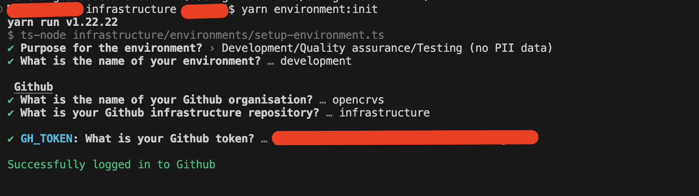
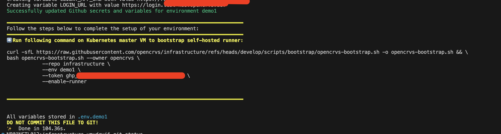

# 4.3.2 Create a Github environment

#### Before you begin

In this section you will run `yarn environments:init` script which will help you to configure OpenCRVS:

* Create GitHub environments
* Draft commands to bootstrap new servers
* Prepare inventory files for ansible for environment provision
* Prepare Helm chart values for deployment

GitHub environments will host all secrets and variables required for successful infrastructure configuration (users, filesystem, kubernetes cluster, etc) and OpenCRVS deployment.

Make sure you completed environment preparation steps and have all required information:

| Property                                                                               | Description                                                                                                                                                                                                                                                             |
| -------------------------------------------------------------------------------------- | ----------------------------------------------------------------------------------------------------------------------------------------------------------------------------------------------------------------------------------------------------------------------- |
| GitHub Organisation                                                                    | Own GitHub organisation with subscription.                                                                                                                                                                                                                              |
| Country config repository                                                              | [4.2.10-build-country-config-docker-image.md](../../3.2-set-up-your-own-country-configuration/4.2.10-build-country-config-docker-image.md "mention")                                                                                                                    |
| Virtual machines (servers) created                                                     | <p><a data-mention href="../4.3.1-preparation-steps/4.3.1.1-setup-infrastructure.md">4.3.1.1-setup-infrastructure.md</a><br>Verify you have IP addresses or DNS names and you are able to login on those VMs</p>                                                        |
| Domain names are registered                                                            | <p><a data-mention href="../4.3.1-preparation-steps/4.3.1.2-configure-dns.md">4.3.1.2-configure-dns.md</a><br>Verify DNS names are pointed to appropriate IP addresses of VMs.</p>                                                                                      |
| SSL Certificates issued or one of the available Let’s Encrypt is considered to be used | [4.3.1.3-issue-ssl-certificates.md](../4.3.1-preparation-steps/4.3.1.3-issue-ssl-certificates.md "mention")                                                                                                                                                             |
| Infrastructure repository forked                                                       | [4.3.1.4-create-prerequisite-accounts-and-repositories.md](../4.3.1-preparation-steps/4.3.1.4-create-prerequisite-accounts-and-repositories.md "mention")                                                                                                               |
| GitHub Token with full code access and workflow permissions created                    | Personal access token (Fine grained token) with access to Country config and Infrastructure repositories. See [4.3.1.4-create-prerequisite-accounts-and-repositories.md](../4.3.1-preparation-steps/4.3.1.4-create-prerequisite-accounts-and-repositories.md "mention") |
| DockerHub Account, token and repository are created                                    | <p><a data-mention href="../4.3.1-preparation-steps/4.3.1.4-create-prerequisite-accounts-and-repositories.md">4.3.1.4-create-prerequisite-accounts-and-repositories.md</a><br>Make sure Country config image was built and pushed to DockerHub</p>                      |
| Users with their public keys to grant remote access to the servers                     | [4.3.5.1-ssh-access.md](../../4.4-advanced-topics/4.3.5.1-ssh-access.md "mention")                                                                                                                                                                                      |
| SMTP server configured                                                                 | [4.3.1.4-create-prerequisite-accounts-and-repositories.md](../4.3.1-preparation-steps/4.3.1.4-create-prerequisite-accounts-and-repositories.md "mention")                                                                                                               |
| Optionally Third-party accounts created (sentry, slack, etc)                           | [4.3.1.4-create-prerequisite-accounts-and-repositories.md](../4.3.1-preparation-steps/4.3.1.4-create-prerequisite-accounts-and-repositories.md "mention")                                                                                                               |

### Create github environments

Environments are managed by `yarn environment:init` script. The script will create files that must be pushed to Git, so it is advisable to run the script in a new branch in order to open a pull request.

Re-run script for each environment:

* development and (or) qa
* staging
* production


_Migrating from an earlier version? ..._&#x20;

Configuring a **staging** or **prodution** Github environment requires you to have a **backup server** environment in place. &#x20;

No explicit **backup** _Github_ environment is created by this script anymore as of OpenCRVS v2.0.


To run the script, open terminal window and cd into your **forked infrastructure repository** and run the following command to start configuration wizard:

<pre><code><strong>yarn install
</strong><strong>yarn environment:init
</strong></code></pre>


Similar commands exist in a forked countryconfig repo but these exist only for backwards compatibility, e.g. OpenCRVS v1.8 or below and **should no longer be used**.  Older installations should follow the [4.3.6 Migration from Docker swarm guide](../4.3.6-migration-from-docker-swarm-guide.md)


You will be asked to provide values to configure key OpenCRVS components. Some actions can be automated and the script will guide you to the next steps.


### Environments init script questions

#### Intro questions

**Purpose for the environment?**

The script will ask you to select the type of environment that you wish to create:

```
? Purpose for the environment? › - Use arrow-keys. Return to submit.
❯   Development/Quality assurance/Testing (no PII data)
    Staging/Production (hosts PII data, requires frequent backups)
```

Depending on your anwer different logic will be executed and some features might be not available. For example Approval workflow work only on environments with PII data.

**What is the name of your environment?**

Environment name is used later to create Kubernetes namespaces and other configuration objects like backup and restore folders. Environment name is read only property.

We recommend you use following environment names:

* development
* qa
* staging or stg
* production or prod

#### GitHub

**What is the name of your Github organisation?** Type your organisation.

_Note that for personal repositories organisation is your GitHub login._

**What is your Github infrastructure repository?** Repository name where your infrastructure code lives.

**What is your Github token?** Classic or Fine-grained token with access to infrastructure workflows and code.

Once you provide answers to the questions script will connect GitHub:

*   If environment doesn't exist, script will continue it's execution

    <figure><figcaption><p>GitHub environment doesn't exist</p></figcaption></figure>
*   If environment exists, script will fetch information about existing secrets and variables for particular environment and repository.<br>

    <figure><figcaption><p>GitHub environment already exists</p></figcaption></figure>
* The script will fail if it cannot connect to Github for whatever reason.

For environments with PII data script will ask you to answer additional questions:

* `GH_APPROVERS`: Comma separated list of GitHub accounts responsible for Reviews and Approvals on OpenCRVS GitHub Actions workflows. This variable is defined at repository level.  **For  production environments, this list is strongly recommended in order to prevent accidental deployments or environment resets, resulting in deletions of citizen data.**
* `APPROVAL_REQUIRED`: Require approval for particular environment. This variable is defined at environment level.  **For  production environments, it is strongly recommended to set this to True in order to prevent accidental deployments or environment resets, resulting in deletions of citizen data.**

<figure><figcaption><p>Configure production environment with required approval</p></figcaption></figure>

#### Docker Hub

The script will ask for your Dockerhub credentials or skip if they already exist. GitHub doesn't allow you to fetch secret values so you will not be able to check the current value, only updating the value is possible.

<figure><figcaption><p>DockerHub credentials were created earlier</p></figcaption></figure>

#### Kubernetes & Runtime

The script will ask you to provide Kubernetes and Runtime options:

* `DOMAIN`: Domain name to expose the OpenCRVS application frontend and APIs.  It will be the domain after the subdomains that you configured when setting DNS.
* `KUBE_API_HOST`: (Options property) IP address or domain Kubernetes master node. Provision script will generate Kubernetes config files for each user defined in users section of inventory file. For more details check [4.3.5.1-ssh-access.md](../../4.4-advanced-topics/4.3.5.1-ssh-access.md "mention") and [4.3.5.2-kubernetes-cluster-access.md](../../4.4-advanced-topics/4.3.5.2-kubernetes-cluster-access.md "mention") sections. Usually you may leave this field empty or set to `DOMAIN`. Value can be modified later.
* `WORKER_NODES`: (Options property) Comma separated list of additional Kubernetes cluster members (Virtual Machines). Leave empty for single node setup. Worker nodes can be added later.

<figure><figcaption><p>Only domain name was provided, Kubernetes cluster will be created with single node</p></figcaption></figure>

#### SSH Users

Script will ask you to create users with remote SSH access, answer following questions:

* User name: Remote user name to login
* Public ssh keys: Add public key(s) for remote login. Login by password is disabled by default, keys must be provided
* Role: User role on remote system

Check documentation for more examples and detailed instructions how to manage remote access: [4.3.5.1-ssh-access.md](../../4.4-advanced-topics/4.3.5.1-ssh-access.md "mention")

Once all the users are added, select **"Save & Exit"** in order to continue with the script.

<figure><figcaption></figcaption></figure>

#### Traefik SSL Certificate

Installation script does configuration for traefik helm deployment.

Following options are available at configuration time:

1. **Lets Encrypt certificate:** No additional questions, preconfigured file is used. Traefik will try to issue Lets encrypt certificate
2. **Static SSL certificate:** Script will ask to provide SSL Certificate and Key for frontend. Provided values will be stored as GitHub secrets.
3. **Custom configuration:** No additional questions, preconfigured file without lets encrypt section is used. Traefik will use its default certificate. This option should be used if you plan to configure Traefik later using helm chart values.

Questions for **Static SSL certificate**

* `SSL_CRT`: SSL Certificate or Certificate chain
* `SSL_KEY`: SSL Certificate private keys

Full documentation about traefik configuration can be found at:

* Official documentation page: [https://github.com/traefik/traefik-helm-chart](https://github.com/traefik/traefik-helm-chart)
* OpenCRVS documentation: [4.5.1-tls-ssl-configuration-for-traefik](../../4.4-advanced-topics/4.5.1-tls-ssl-configuration-for-traefik "mention")

#### Storage

Disk Encryption: If disk encryption is enabled, provision GitHub Actions workflow will create encrypted file in the root (`/`) directory and mount it as `/data`. Disk encryption is optional. Disk encryption can't be enabled later.

* `DISK_SPACE`: Amount of disk space that should be dedicated to OpenCRVS data (logs, monitoring and citizens crvs records). Specified value will become the size of an encrypted cryptfs `/data` directory. Specified disk space will be allocated on each cluster node for multi-node kubernetes cluster and this behaviour may change in the future.

#### Backup

* `BACKUP_HOST`: Backup server IP address or hostname.
* `BACKUP_SERVER_USER`: User to connect to backup server. At this point you may choose any username, provision script will create user for you. E/g If you would like to use shared server to store backups from qa and production, you may want to have separate users for security reasons.

Script will add backup host to ansible inventory files and configure appropriate values for helm release. Script will create private/public key-pair for backup server user.

By default backup is configured to run at 01:00 AM by UTC, if you need to adjust backup schedule, update configuration manually at `environments/<env>/dependencies/values.yaml`

<figure><figcaption><p>Backup configuration</p></figcaption></figure>

More information about backup server configuration can be found at [Backup and Restore](../../4.4-opencrvs-maintenance-tasks/4.3.7-backup-and-restore) section.

#### Restore

Restore configuration will ask you to provide restore environment name from existing environment list. If environment doesn't exist and will be created later, feel free to type future environment name here, but don't forget to create environment before running OpenCRVS dependencies deployment.

By default restore is configured to run at 00:00 AM by UTC, if you need to adjust restore schedule, update configuration manually at `environments/<env>/dependencies/values.yaml`

<figure><figcaption><p>Restore configuration</p></figcaption></figure>

#### Databases & monitoring

* Disk Encryption: If disk encryption is enabled, provision GitHub Actions workflow will create encrypted file in the root (`/`) directory and mount it as `/data`. Disk encryption is optional. Disk encryption can't be enabled later.
* `DISK_SPACE`: Amount of disk space that should be dedicated to OpenCRVS data (logs, monitoring and citizens crvs records). Specified value will become the size of an encrypted cryptfs `/data` directory. Specified disk space will be allocated on each cluster node for multi-node kubernetes cluster and this behaviour may change in the future.
* `KIBANA_USERNAME`: (Default: opencrvs-admin): Kibana user name
* `KIBANA_PASSWORD`: (Default: random value): Kibana password

<figure><figcaption><p>Database and monitoring sections. In this example disk encryption is already enabled</p></figcaption></figure>

#### Sentry

`SENTRY_DSN`: The DSN tells the SDK where to send the events to. OpenCRVS application has built-in Sentry support.

<figure><figcaption></figcaption></figure>

#### Metabase admin

* `OPENCRVS_METABASE_ADMIN_EMAIL`: Metabase Admin user (only emails are allowed)
* `OPENCRVS_METABASE_ADMIN_PASSWORD`: Metabase Admin password

<figure><figcaption><p>Metabase configuratiob section</p></figcaption></figure>

#### SMTP

At this point smtp server should be configured. If you are using third-party email providers like gmail or sendgrid, please make your OpenCRVS domain is in whitelist and issued credentials are correct. For more information please check [4.3.1.1-setup-infrastructure.md](../4.3.1-preparation-steps/4.3.1.1-setup-infrastructure.md "mention")

* `SMTP_HOST`: Hostname or IP address of your smtp server
* `SMTP_PORT`: Port where smtp server is listening
* `SMTP_SECURE`: Use TLS for connection
* `SMTP_USERNAME`: Username or email used to authenticate as a email client on smtp server
* `SMTP_PASSWORD`: Password or API token depend on your email provider
* `SENDER_EMAIL_ADDRESS`: All emails will be send with this email in sender field
* `ALERT_EMAIL`: Email address for alerting, this field is often used to integrate with Slack, Google Chart or any other corporate communication tool.

<figure><figcaption><p>Email configuration</p></figcaption></figure>

#### Review step

Once all questions are answered the script will generate strong database passwords for all the database technologies used in OpenCRVS. It will display all the secrets that the script will create and ask you if you want to continue to create the environment on Github.

The script will slowly create the Github environment and upload all the secrets OpenCRVS requires to provision and deploy OpenCRVS from Github Actions. It will create Helm chart and values files ready for committing to your repository.

On the final step the script will provide a command to bootstrap a self-hosted runner on your server. **Save the command from script output to a temporal file, you will need it later**.

This is explained in the section [4.3.3 Bootstrap servers](../4.3.2-bootstrap-servers.md):


```
curl -sfL https://raw.githubusercontent.com/opencrvs/infrastructure/refs/heads/develop/scripts/bootstrap/opencrvs-bootstrap.sh \
     -o opencrvs-bootstrap.sh && \
bash opencrvs-bootstrap.sh --owner opencrvs \
            --repo my-custom-infrastructure \
            --env qa \
            --token gh_PARSONAL_ACCESS_TOKEN \
            --enable-runner
```


<figure><figcaption><p>Command to bootstrap self-hosted runner on newly created virtual machine. Script will provide additional commands and hints for multi-node Kubernetes cluster and for configuration with backup server</p></figcaption></figure>

Run following command on your infrastructure repository:

```
git status
```

You should get a number of files modified:

```
Changes not staged for commit:
  (use "git add <file>..." to update what will be committed)
  (use "git restore <file>..." to discard changes in working directory)
        modified:   .github/workflows/deploy-dependencies.yml
        modified:   .github/workflows/deploy-opencrvs.yml
        modified:   .github/workflows/github-to-k8s-sync-env.yml
        modified:   .github/workflows/k8s-reindex.yml
        modified:   .github/workflows/k8s-reset-data.yml
        modified:   .github/workflows/k8s-seed-data.yml
        modified:   .github/workflows/provision.yml
        modified:   .github/workflows/reset-2fa.yml
Untracked files:
  (use "git add <file>..." to include in what will be committed)
        environments/development/
        infrastructure/server-setup/inventory/development.yml
```

Usually review is not required for files under the `.github` folder.

Review modified files:

* `infrastructure/server-setup/inventory/<environment name>.yml`: Configuration file for Ansible playbook responsible for server provision. For more information please follow hints inside file and [SSH Access](../../4.4-advanced-topics/4.3.5.1-ssh-access.md) section.
* `environments/<environment name>`: Folder with `values,yaml` files for helm charts:
  * `environments/<environment name>/traefik/values.yaml`: Update this file with proper configuration to handle SSL certificate. Please follow documentation under [TLS / SSL & DNS](../../4.4-advanced-topics/4.5.1-tls-ssl-configuration-for-traefik)
  * `environments/<environment name>/opencrvs-services/values.yaml`: Review configuration and adjust according to your needs, **usually defaults are good for initial deployment**
  * `environments/<environment name>/dependencies/values.yaml`: Review configuration and adjust according to your needs, **usually defaults are good for initial deployment**.

### Final notice


The provision script will disable password SSH access for all users on the server and create new users from the `infrastructure/server-setup/inventory/<environment name>.yml` file. After provisioning, SSH will only be possible using public/private key pairs.



Users will be required to use Google Authenticator to SSH in after provisioning. This 2FA approach is an important step to secure your infrastructure.



If any user is utilising the 1000 group, the script will fail. Modify your available user groups to ensure this one is available.



The .env.\<your environment> file contains sensitive information about your environment configuration. Copy content of this file into secure place or password manager such as [Bitwarden](https://bitwarden.com/) or [1Password](https://1password.com/) and delete this file. **YOU MUST NEVER SHARE THIS FILE, NOR COMMIT IT TO GIT!!!** This file is not required by OpenCRVS.


You will notice that an environment now exists in your Github repo containing all the secrets required.


If you made a mistake and wish to run the script for this environment again, you must delete the environment on Github by clicking the trash icon first. **The environment and all secrets will be deleted and recreated, enforcing you to start over.**



You may run this step right after "development" and "qa" environment is created or later.


**Repeat the process for all your required environments, e.g. qa, production, staging ...**&#x20;

Once all environments are setup, feel free to continue.
