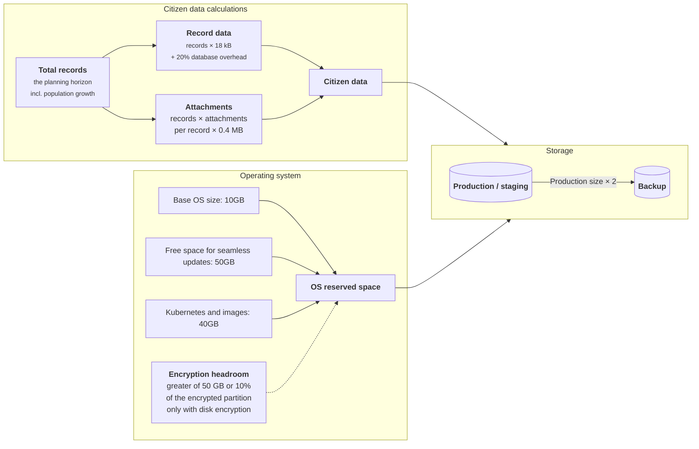

# Setup infrastructure

### Data Center

OpenCRVS should only be provisioned on servers located in an equivalent minimum of a [certified Tier 2 or 3 Datacenter](https://uptimeinstitute.com/tier-certification/tier-certification-list).

Implementers should refer to the “Uptime Institute” design documents for specific requirements associated with Tier 2 & 3 certification. At a high-level, the datacenter should have:

* Uninterrupted power supply with independent, backup power generation
* Air conditioning
* 24/7 security access for authorised technical staff only
* Automatic server backup off-site
* Failsafe internet connectivity
* Security policies and procedures in place
* Network administrator staff capable of configuring and maintaining a scalable VPN solution

We appreciate that connectivity is a challenge in many countries where we work. The data centre should have **an absolute minimum of a 10Mbps internet connection** to the servers otherwise deploying to the servers will be unworkable.

### Server environments

Before proceeding to discuss server specifications, it is important to understand the following server environment glossary that we will be referring to in our example countryconfig reference implementation and further sections.

| Environment                           | Description                                                                                                                                                                 | Authentication                                                      |
| ------------------------------------- | --------------------------------------------------------------------------------------------------------------------------------------------------------------------------- | ------------------------------------------------------------------- |
| **production**                        | A live environment containing citizen data e.g: personally identifiable information (PII).                                                                                  | 2FA codes generated for production user access                      |
| **staging** (pre-production / mirror) | A mirror of a live environment, used for final Quality Assurance of a production deployment containing a daily restored backup of citizen data (PII) from the previous day. | 2FA codes generated for production user access                      |
| **qa**                                | A quality assurance environment for tester, trainer & developer use supporting the Quality Assurance of releases, training staff.                                           | Test 2FA codes of 6 zeros allow test user access.                   |
| **backup**                            | A low specification environment that simply stores encrypted backups from production for long term recovery.                                                                | Not applicable. OpenCRVS software does not run on this environment. |
| **development**                       | An environment you can use for training and development purposes only. NOT FOR PRODUCTION USE!!                                                                             | Test 2FA codes of 6 zeros allow test user access.                   |

Before proceeding to discuss network specifications, it is important to understand the following other concepts:

* **vpn:** All servers must be protected behind a government virtual private network (VPN). [_Learn why a VPN is important._](https://documentation.opencrvs.org/technical/guides/installation/advanced-topics/why-vpn) Users must authenticate via the VPN to access OpenCRVS in a browser. The country should provide and operate the VPN. When using self-hosted GitHub Actions runners, place those runners inside the VPN or on the internal network so they can reach servers directly; no VPN tunnel from GitHub-hosted services is required.
* **Continuous provisioning & deployment via GitHub Actions:** OpenCRVS provides GitHub Actions workflows for automated provisioning and deployment. A GitHub organisation is required. Self-hosted runners deployed within your VPN/internal network (recommended).
* **bastion** or **jump:** An optional bastion (jump) host can consolidate and control SSH access to servers behind the VPN without distributing VPN credentials. Bastions are useful for administrative SSH access, auditing and as an alternative deployment hop even when using self-hosted runners inside the VPN.

### Server specifications

Refer to these minimum server specifications for the above environments. Note that the hard-disk space specifications are illustrative. Depending on the population size, number of records to migrate and number of supporting documents that are required to be captured during civil registration business processes, you may require more RAM / disk-space.

These are **absolute minimum specifications**.

Regardless your system administrators must be capable of monitoring and increasing server disk-space on demand. :

### Minimum server specifications

| Environment (use)                              | Minimum specification                                                                                                                  |
| ---------------------------------------------- | -------------------------------------------------------------------------------------------------------------------------------------- |
| development (learning / proof-of-concept) / qa | 16 GB RAM · 4 vCPU · 320 GB disk · Ubuntu 24.04 LTS x64 (headless)                                                                     |
| production / staging                           | 32 GB RAM · 8 vCPU · disk space calculated as described in [Production / staging / backup disk space requirements](#production-staging-backup-disk-space-requirements) · Ubuntu 24.04 LTS x64 (headless) |
| backup                                         | 1 GB RAM · 2 vCPU · disk space calculated as described in [Production / staging / backup disk space requirements](#production-staging-backup-disk-space-requirements) (2× the production disk size) · Ubuntu 24.04 LTS x64 (headless) |

Notes:

* Disk-space values are minimums and illustrative; adjust based on population, attachments and retention needs.
* Ensure administrators can monitor and expand disk capacity on demand.
* Production clusters should follow recommendations in the "Server clusters by project" section for HA and scalability.
* By default, all OpenCRVS data is stored on the Kubernetes master node, so the calculated production / staging disk space applies to the master node.

### Ubuntu version


If you are not using the correct version of Ubuntu, either recreate the server or upgrade Ubuntu.


OpenCRVS v2.0 supports the Ubuntu Server LTS release 24.04

Verify your release version using following command:

```
lsb_release -a
```

Example output

```
No LSB modules are available.
Distributor ID: Ubuntu
Description:    Ubuntu 24.04.4 LTS
Release:        24.04
Codename:       noble
```

### Production / staging / backup disk space requirements


The disk space calculated below covers citizen data only. It does not include monitoring data or logs, which need additional space unless they are stored elsewhere. Options include:

* **Same server**: add the space described in [Monitoring disk space requirements](#monitoring-disk-space-requirements) and [Logging disk space requirements](#logging-disk-space-requirements).
* **Dedicated storage**: mount a separate disk or partition for monitoring and logging data.
* **Dedicated Elasticsearch instance**: send monitoring and logging data to a separate Elasticsearch server or cluster.
* **Cloud monitoring service**: use a hosted monitoring service (e.g. Elastic Cloud) instead of storing the data locally.


Size the disks of production, staging and backup servers from the number of records you expect to store over your planning horizon and the average number of attachments per record. Staging holds a daily restore of production data, so give it the same disk size as production.

By default, all disk space is allocated on the **Kubernetes master node**: every datastore keeps its data in `/data` on that node. In a multi-node cluster, the production / staging disk size calculated below therefore applies to the master node, not to each server. Spreading data across several nodes is supported by OpenCRVS, but requires manually setting values in the [OpenCRVS Dependencies Helm chart](https://github.com/opencrvs/opencrvs-core/tree/develop/charts/dependencies) (see [Disk layout requirements](#disk-layout-requirements)).

#### How the disk size adds up

The diagram shows what makes up each disk.





#### Estimate the number of records

Choose a planning horizon: the number of years of records the disk must hold before you plan to expand it. Then estimate how many records you will register in the first year across all event types, and how fast the population grows.

Use your registration statistics if you have them. Otherwise, estimate births and deaths from the population and the crude birth and death rates (per 1,000 people per year). For a pilot, use the population of the participating locations only.

If your national statistics office does not publish these figures, you can find them for every country in World Bank Open Data ([Population, total](https://data.worldbank.org/indicator/SP.POP.TOTL), [Birth rate, crude](https://data.worldbank.org/indicator/SP.DYN.CBRT.IN), [Death rate, crude](https://data.worldbank.org/indicator/SP.DYN.CDRT.IN), [Population growth](https://data.worldbank.org/indicator/SP.POP.GROW)) or in the UN [World Population Prospects](https://population.un.org/wpp/).

```
births_per_year  = population * crude_birth_rate / 1000
deaths_per_year  = population * crude_death_rate / 1000
records_per_year = births_per_year + deaths_per_year + other_records_per_year
growth_factor    = ((1 + growth_rate)^years - 1) / growth_rate
total_records    = records_per_year * growth_factor + records_to_migrate
```

* `growth_rate` is the annual population growth rate as a decimal, e.g. 1% = 0.01. Registrations grow with the population, so each year has `(1 + growth_rate)` times as many records as the year before. `growth_factor` adds up all years of the planning horizon. If the population is not growing, use `growth_factor = years`.
* `records_to_migrate` is the number of existing records you will import into OpenCRVS, if any. Count them once, not per year.



#### Calculate the citizen data

An attachment averages 0.4 MB. A record's data, excluding attachments, averages 18 kB. The database needs about 20% more space than the record data itself for indexes, the write-ahead log (WAL) and bloat.

```
attachments       = total_records * attachments_per_record * 0.4 MB
record_data       = total_records * 18 kB
database_overhead = 20% * record_data
citizen_data      = attachments + record_data + database_overhead
```



#### Add encryption headroom (encrypted disks only)

With disk encryption, `/data` is an encrypted partition. Provisioning reserves free space outside it: the greater of 50 GB or 10% of the partition size. These are the defaults of `min_free_disk_size` and `min_free_disk_percent`; if you change them, use your values. See **Extra headroom required when using disk encryption** under [Disk layout requirements](#disk-layout-requirements).

```
encrypted_partition = citizen_data   # plus monitoring and logging, if stored in /data
encryption_headroom = max(50 GB, 10% * encrypted_partition)
```

Monitoring and logging data are stored in `/data` by default, so include them if you keep them on this server. Without disk encryption, skip this step (`encryption_headroom` is 0).



#### Calculate the production and staging disk

Add 100 GB for the operating system and container images.

```
production_disk = 100 GB + citizen_data + encryption_headroom
```

If monitoring and logging data stay on this server, add their space as well (see the note at the top of this section).



#### Calculate the backup disk

The backup server stores encrypted backups from production. We recommend twice the production / staging disk size.

```
backup_disk = 2 * production_disk
```



#### Worked example

A country with a population of 30M, a crude birth rate of 17.299 and a crude death rate of 7.7 per 1,000 people, a population growth rate of 1% per year and an average of 3 attachments per record. The example counts births and deaths only, has no records to migrate, and assumes monitoring and logging data are stored elsewhere.

The table below uses a planning horizon of 1 year, so `growth_factor` is 1.

| Quantity                                          | Calculation                         | Result                   |
| ------------------------------------------------- | ----------------------------------- | ------------------------ |
| Births per year                                   | 30,000,000 × 17.299 / 1,000         | 518,970                  |
| Deaths per year                                   | 30,000,000 × 7.7 / 1,000            | 231,000                  |
| Total records (1 year)                            | 518,970 + 231,000                   | 749,970                  |
| Attachments                                       | 749,970 × 3 × 0.4 MB                | 899,964 MB ≈ 899.96 GB   |
| Record data                                       | 749,970 × 18 kB                     | 13,499,460 kB ≈ 13.50 GB |
| Database overhead                                 | 20% × 13.50 GB                      | 2.70 GB                  |
| Citizen data                                      | 899.96 GB + 13.50 GB + 2.70 GB      | 916.16 GB                |
| Encryption headroom                               | greater of 50 GB or 10% × 916.16 GB | 91.62 GB                 |
| **Production / staging disk, without encryption** | 100 GB + 916.16 GB                  | **1,016.16 GB**          |
| **Production / staging disk, with encryption**    | 100 GB + 916.16 GB + 91.62 GB       | **1,107.78 GB**          |
| **Backup disk (production without encryption)**   | 2 × 1,016.16 GB                     | **2,032.32 GB**          |
| **Backup disk (production with encryption)**      | 2 × 1,107.78 GB                     | **2,215.56 GB**          |

For longer planning horizons, multiply the first-year records and citizen data by `growth_factor` and recalculate the disks:

| Planning horizon | Growth factor (1%) | Total records | Citizen data | Production / staging disk (without / with encryption) | Backup disk (without / with encryption) |
| ---------------- | ------------------ | ------------- | ------------ | ----------------------------------------------------- | --------------------------------------- |
| 1 year           | 1.0000             | 749,970       | 916.16 GB    | 1,016.16 / 1,107.78 GB                                | 2,032.32 / 2,215.56 GB                  |
| 3 years          | 3.0301             | 2,272,484     | 2,776.07 GB  | 2,876.07 / 3,153.68 GB                                | 5,752.14 / 6,307.36 GB                  |
| 5 years          | 5.1010             | 3,825,601     | 4,673.35 GB  | 4,773.35 / 5,240.69 GB                                | 9,546.70 / 10,481.38 GB                 |
| 10 years         | 10.4622            | 7,846,346     | 9,585.10 GB  | 9,685.10 / 10,643.61 GB                               | 19,370.20 / 21,287.22 GB                |

Work is ongoing in OpenCRVS to optimise storage in future versions.

### Monitoring disk space requirements

In default configuration monitoring data is stored for 30 days. Monitoring data size depends on filebeat configuration (scrape frequency, collected metrics, labels, tags). OpenCRVS is using custom filebeat configuration file, optimised to store only valuable data. Average disk size for monitoring data is 200 MB per host per day. In general value can be calculated by formula:

```
Total space = 200 MB * <days> * <hosts> + 1 GB * <hosts>
```

* `200 MB`: disk size per host per day
* `days`: number of days to store monitoring data
* `hosts`: number of hosts (VMs) being monitored
* `1 GB`: minimal extra space for each VM

For single VM at least 7 GB of additional disk space is needed to store monitoring data for 30 days:

```
Total space = 200 MB * 30 * 1 + 1 GB * 1 = 7 GB
```

For Kubernetes cluster with 2 VMs at least 14 GB of additional disk space will be needed:

```
Total space = 200 MB * 30 * 2 + 1 GB * 2 = 14 GB
```

If scrape frequency, collected metrics, labels, tags were adjust then make sure disk size per day value is up to date.

### Logging disk space requirements

Logging data is stored as Elasticsearch index and can be accessed any time in Kibana.

Logging data is generated by few different sources:

* Elastic APM agents installed within critical OpenCRVS components
* OpenCRVS application and datastores logs
* Operating system logs

By default OpenCRVS monitoring helm chart is configured to store data for 1 week only. There is no way to estimate logging data usage, but it's recommended to keep at least 10 GB of disk space for logs.

### Disk layout requirements

By default OpenCRVS stores citizens records, monitoring and logging in the `/data` folder on the Kubernetes master node. There are few options available to define disk partitioning:

* **Single disk partition**: disk partition mounted as `/` has sufficient space to store all data produced by OpenCRVS. At provision time `/data` folder is created by ansible scripts.
* **Single disk partition with encryption**: same as previous, with encryption enabled OpenCRVS will create encrypted file on disk `/cryptfs_file_sparse.img`, allocate proper file size and mount file as `/data` partition.


Only enable disk encryption where it is genuinely required by your security requirements — for example, where the physical security of the server cannot be guaranteed. If your datacentre is physically secure, we do not recommend encryption, since it adds operational complexity and requires substantial extra disk-space headroom (see below). If your datacentre is insecure and you do need encryption, pay close attention to the **optional disk encryption for lower security data centres** section below.


* **Dedicated disk partition for data**: A system administrator may choose to store citizen data on a dedicated disk partition (e.g. LVM, NAS). If so, the partition must be mounted at the `/data` directory.
* **Other layouts** are possible, but require manual configuration:
  * The OpenCRVS Ansible provisioning script lets you set a custom location for the encrypted data file with the `data_file_path` variable.
  * The [OpenCRVS Dependencies Helm chart](https://github.com/opencrvs/opencrvs-core/tree/develop/charts/dependencies) lets you set the data directory path for each datastore with the `host_data_path` variable.

**Verify the disk has been partitioned correctly**

We want to ensure the partition mounted to / has enough disk space. OpenCRVS citizen data will be stored in the following location:

```
/data
```

Here is example of disk layout:

```
root@yourserver:~$ df -h
Filesystem           Size  Used Avail Use% Mounted on
/dev/vda1            311G  32G   280G  67% /
/dev/vda15           105M  6.1M   99M   6% /boot/efi
```

This server has 280 GB available after the operating system has been deployed. You should set aside a further 50-75 GB for Docker images, so only 205-230 GB is available. The 100 GB operating system allowance used in the [disk space calculation](#production-staging-backup-disk-space-requirements) already includes the space for Docker images.

**Extra headroom required when using disk encryption**

If you plan to configure disk encryption, you need considerably more free space than just the size of the encrypted partition itself. The encrypted volume is formatted with ext4, and its journal and inode-table metadata scale with the size of the partition rather than the amount of data actually stored in it — so a buffer that's comfortable for a small encrypted partition can be badly insufficient for a multi-terabyte one, and running out of room here can cause an outage.

Provisioning automatically reserves, outside of the encrypted partition, whichever is greater of:

* a fixed minimum (`min_free_disk_size`, defaults to `50g`), or
* a percentage of the encrypted partition size (`min_free_disk_percent`, defaults to `10`)

Both are configurable in `infrastructure/server-setup/group_vars/all.yml`. For example, with the defaults above:

* on the server above (~230GB available), a 150GB encrypted partition needs 200GB free (150GB + the 50GB fixed floor, since 10% of 150GB is only 15GB) — comfortably within the 230GB available
* a 5TB encrypted partition needs 5.5TB free (5TB + 500GB, since 10% of 5TB now exceeds the fixed floor) — this is the case the percentage rule exists for

Provisioning checks this automatically — both before first creating the encrypted partition and on every subsequent run — and fails with the exact shortfall rather than silently proceeding, so increase the root partition size first if it does.


Always test infrastructure change requests — including resizing a partition, changing the encrypted disk size, or adjusting these headroom settings — on a dedicated staging server first, and confirm a production backup restores successfully there, before applying the same change to production.


**Regarding optional disk encryption for lower security data centres**


Only use encryption if your data centre is equivalent to a Tier 2 or lower, where physical security may not be at its optimum. If your data centre tier is higher, and extremely secure, there should be no need to encrypt the disk.


To use 200GB, you would enter "200g" when prompted.

It is optional to LUKS encrypt this location so that your data is encrypted at rest. You will be asked if you wish to encrypt and how much server space you should apply to the encrypted disk.

The secret ENCRYPTION\_KEY is used on reboot to decrypt and mount this folder. To take advantage of this feature, amend the location of the key to a secure location in `infrastructure/server-setup/group_vars/all.yml`:

```yaml
# Disk Encryption key location as an example (in production use a hardware security module)
disk_encryption_key_path: /root/disk-encryption-key.txt
```


All the secrets are explained in more detail in the section [Environment secrets and variables explained.](../create-a-github-environment/environment-secrets-and-variables-explained.md)


### Server clusters by project

The number of servers required in a load balanced cluster is configurable depending on the project and population size. Please take note of these recommendations.

#### Proof-of-concept (P.O.C.)

For a proof-of-concept (P.O.C.) of OpenCRVS, we use 1 **qa** server with **no backup**, operating under the condition that no live citizen data is captured during a P.O.C: **qa** x 1

#### Pilot

A total of 4 servers are required for pilot implementations that capture citizen data. One for each environment: **qa** x 1, **production** x 1, **staging** x 1 & **backup** x 1.

#### National scale

For national scale implementations, we recommend deploying to a production server cluster of 2 - 5 production servers depending on population size.


It is recommended to deploy the production environment on a cluster of at least 2 servers. This ensures high availability and prevents downtime or data loss in the event of a server failure.


| Population size | Servers required                                                 |
| --------------- | ---------------------------------------------------------------- |
| < 30M           | **qa** x 1, **production** x 2, **staging** x 1 & **backup** x 1 |
| 30M - 60M       | **qa** x 1, **production** x 3, **staging** x 1 & **backup** x 1 |
| 60M+            | **qa** x 1, **production** x 5, **staging** x 1 & **backup** x 1 |

### Network

Refer to the following network diagram as a reference example of how to network your server cluster.

<figure><figcaption></figcaption></figure>

<figure><figcaption></figcaption></figure>

### Server administrator SSH access & permissions:

During provisioning, the server administrator requires SSH access through the provided VPN to all servers with **sudo** permissions.

During installation of OpenCRVS, SSH config to all servers will be modified, blocking password based SSH authentication, root user access, configuring 2FA authentication and alerting for all future SSH access.

Once provisioned, there should be no need for technical staff to ever SSH into a server during day-to-day operations. Every SSH access going forward is audited via a Slack notification to all technical staff thanks to these provisioned alerts.

### User access

The following users will access 3 of the environments: **qa**, **production** & **staging**, via a VPN client:

1. Existing Civil Registration staff that access the OpenCRVS client using the Chrome browser on desktops/laptops/mobile devices.
2. 3rd party approved government staff (e.g. Healthcare staff in hospitals) that access the OpenCRVS client using the Chrome browser on desktops/mobile devices.
3. Your development and QA team that access the OpenCRVS client using the Chrome browser on desktops/laptops/mobile devices.
4. Potential future automated integrations from approved healthcare services using our [APIs](https://documentation.opencrvs.org/technology/interoperability/event-notification-clients) with VPN access
5. Potential future automated integrations external gov services using our [APIs](https://documentation.opencrvs.org/technology/interoperability/event-notification-clients) with VPN access
6. Automated continuous deployment scripts from a private Github code repository.


All user workstations / tablets / smartphones and integrating APIs will require compatible VPN clients and accounts.


### Egress (outbound) internet access

In addition to serving user traffic the OpenCRVS infrastructure needs to be able to communicate outbound. This egress traffic includes things like pulling in latest updates, monitoring and emails.

Check that the servers have internet connectivity. The servers must be able to access Dockerhub, Sentry and other internet services such as Ubuntu update repositories, Email & SMS apis for example. Therefore check if you can ping google.com from inside the servers.

If your VPN requires a whitelist of allowed domains, the following are the known domains which the servers require access to:

```
archive.ubuntu.com
changelogs.ubuntu.com
hub.docker.com
auth.docker.io
registry-1.docker.io
download.docker.com
sentry.io
fonts.gstatic.com
storage.googleapis.com
fonts.googleapis.com 
github.com
acme-v02.api.letsencrypt.org (if using LetsEncrypt TLS certs)
registry.npmjs.org
registry.yarnpkg.com
eu.ui-avatars.com
... Other domains may be required depending on your configuration
```

### Email (SMTP) server

You must have a working SMTP server and SMTP user details to deploy OpenCRVS. Staff onboarding and monitoring requires an Email service.

Following variables are required to successfully deploy OpenCRVS on server environment

* `SMTP_HOST`: Hostname or IP address of your smtp server
* `SMTP_PORT`: Port where smtp server is listening
* `SMTP_SECURE`: Use TLS for connection
* `SMTP_USERNAME`: Username or email used to authenticate as a email client on smtp server
* `SMTP_PASSWORD`: Password or API token depend on your email provider
* `SENDER_EMAIL_ADDRESS`: All emails will be send with this email in sender field
* `ALERT_EMAIL`: Email address for alerting, this field is often used to integrate with Slack, Google Chart or any other corporate communication tool.
