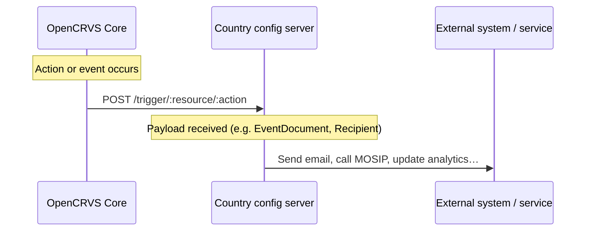

# Action triggers

**Action triggers** are the primary way to listen for events happening inside OpenCRVS core — for example, a birth declaration, a new event being created, or a user being created. Technically, action triggers are HTTP endpoints implemented by the country config server that OpenCRVS core calls when an action occurs.

Action triggers can be used for a variety of purposes, such as:

* Collecting birth registration data into an analytics system
* Sending the birth informant an email when a birth is registered
* Integrating with third-party systems — for instance, requesting a UIN from MOSIP or submitting death information to a social protection system


Starting from OpenCRVS 2.0, the country config package is responsible for sending all email and SMS messages.


Every trigger request targets a path following the schema `/trigger/:resource/:action` (e.g. `/trigger/user/user-updated`). For resources with subresources — such as events containing actions — the schema is `/trigger/:resource/:subresource/:action` (e.g. `/trigger/events/birth/actions/REGISTER`). All requests use the `POST` method and include a payload, except `GET /trigger/system/ready`.


Before OpenCRVS 2.1, the user and system triggers were served under `/triggers/` (plural). All triggers now use `/trigger/`. `npx @opencrvs/toolkit upgrade` renames the Hapi route paths in your country configuration and lists any `/triggers/` reference it could not rewrite, for you to rename by hand.


All user-specific triggers include a `Recipient` object in the payload, describing the contact details of the user to whom the message should be sent.

The event triggers can accept the action synchronously (HTTP 200), reject it synchronously (HTTP 400), or defer the response for asynchronous external validation (HTTP 202). A deferred action must later be accepted or rejected with the country configuration's own system client credentials — see [Action confirmation](action-confirmation.md). [Example](../integrations/mosip-registration-integration.md)

The `Authorization` header of an event trigger request carries a service token that only proves the request came from OpenCRVS Core. It has no scopes, so it cannot be used to call back into Core.

| Path                                                 | Payload                                                                                                                                | Triggered when                                                                                                                                  |
| ---------------------------------------------------- | -------------------------------------------------------------------------------------------------------------------------------------- | ----------------------------------------------------------------------------------------------------------------------------------------------- |
| `/trigger/events/${eventType}/actions/${actionType}` | `EventDocument`                                                                                                                        | An action for an event is **requested** but not yet approved. Country config can use this trigger to intercept and approve or reject an action. |
| `/trigger/system/ready`                             | N/A                                                                                                                                    | System seeding is completed.                                                                                                                    |
| `/trigger/user/user-created`                        | `{ recipient: Recipient, username: z.string(), temporaryPassword: z.string() }`                                                        | A new user is created. Use this to send login details to the newly created user.                                                                |
| `/trigger/user/user-updated`                        | `{ recipient: Recipient, oldUsername: z.string(), newUsername: z.string() }`                                                           | A user's username is changed. Use this to send the new username to the user — for example, when a legal name change requires a new username.    |
| `/trigger/user/username-reminder`                   | `{ recipient: Recipient, username: z.string() }`                                                                                       | A user requests a username reminder during the authentication process.                                                                          |
| `/trigger/user/reset-password`                      | `{ recipient: Recipient, code: z.string() }`                                                                                           | A user requests a password reset during the authentication process.                                                                             |
| `/trigger/user/password-reset-link`                  | `{ recipient: Recipient, token: z.string() }`                                                                                          | A user asks to reset their password from the login page and an account matches the email or phone number. Send a single-use recovery link built from your `LOGIN_URL`: `${LOGIN_URL}/recover?token=<token>`. |
| `/trigger/user/username-reminder-link`               | `{ recipient: Recipient, token: z.string() }`                                                                                          | A user asks for their username from the login page and an account matches the email or phone number. Send a single-use recovery link built the same way as for `password-reset-link`. |
| `/trigger/user/resend-invite`                        | `{ recipient: Recipient, username: z.string(), temporaryPassword: z.string() }`                                                        | An admin resends the invitation to a user who has not yet activated their account.                                                              |
| `/trigger/user/reset-password-by-admin`             | `{ recipient: Recipient, temporaryPassword: z.string(), admin: z.object({ id: z.string(), name: NameFieldValue, role: z.string() }) }` | An admin resets a user's password.                                                                                                              |
| `/trigger/user/2fa`                                 | `{ recipient: Recipient, code: z.string() }`                                                                                           | A user authenticates with 2FA enabled. Use this to deliver the 2FA code — for example, via email.                                               |
| `/trigger/user/all-user-notification`               | `{ recipient: Recipient, subject: z.string(), body: z.string() }`                                                                      | An admin sends an all-user notification — for example, ahead of a scheduled system upgrade.                                                     |
| `/trigger/user/change-phone-number`                 | `{ recipient: Recipient, code: z.string() }`                                                                                           | A user changes their phone number in profile settings. Use this to send a verification code to their registered email address.                  |
| `/trigger/user/change-email-address`                | `{ recipient: Recipient, code: z.string() }`                                                                                           | A user changes their email address in profile settings. Use this to send a verification code to their previously registered email address.      |
