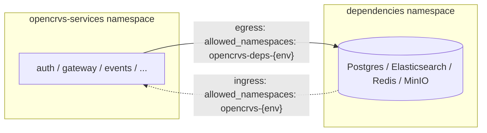

# Ingress/Egress access

### Overview


Requires a CNI provider that enforces NetworkPolicy (e.g. Calico, Cilium).


Network traffic between OpenCRVS pods is restricted using Kubernetes `NetworkPolicy` resources. This document gives an overview of the Kubernetes `NetworkPolicy` configuration shipped with the OpenCRVS services and dependencies Helm charts.

The following configuration is applied by default:

* NetworkPolicy is enabled by default (`network_policy.enabled`).
* Ingress and egress traffic are restricted by default (`network_policy.<ingress|egress>_mode`).
* Each Helm chart (`dependencies`, `opencrvs-services`) has its own configuration for ingress and egress policy.
* Every pod can always reach other pods in its own namespace (`allow_same_namespace`).
* NetworkPolicy resources are recreated on every `helm upgrade`, so the cluster always matches `values.yaml`.

### Ingress / egress modes

Each Helm chart exposes `network_policy.ingress_mode` and `network_policy.egress_mode`, configurable globally and per service:

| Mode      | Behavior                                                                                                                        |
| --------- | ------------------------------------------------------------------------------------------------------------------------------- |
| `deny`    | Nothing allowed beyond same-namespace / `allowed_namespaces` / explicit rules.                                                  |
| `private` | Additionally allow RFC1918 private ranges (`10.0.0.0/8`, `172.16.0.0/12`, `192.168.0.0/16`); the public internet stays blocked. |
| `full`    | No restriction.                                                                                                                 |

Default posture per chart:

| Chart               | `ingress_mode` | `egress_mode` |
| ------------------- | -------------- | ------------- |
| `dependencies`      | `deny`         | `deny`        |
| `opencrvs-services` | `deny`         | `private`     |

`opencrvs-services` ships with `egress_mode: private` rather than `deny` so the application can reach the `dependencies` chart and other in-VPC services without every deployment having to configure `allowed_namespaces` up front.

### Public entry points

The following services are allowed to accept connections from any private subnet:

* `client`
* `gateway`
* `login`
* `countryconfig`
* `dashboards`

Every other service accepts ingress only from its own namespace.

### Cross-namespace access

The `dependencies` chart (Postgres, Elasticsearch, Redis, MinIO) and `opencrvs-services` chart are typically deployed to separate namespaces. `network_policy.allowed_namespaces` grants one half of that access per chart:



`{env}` in this diagram refers to the environment name (e.g. `production`, `qa`).


Both sides must be configured. Setting `allowed_namespaces` on only one chart opens that chart's side of the connection but not the other — traffic still won't flow until both are set.


```yaml
# dependencies chart values.override.yaml
network_policy:
  allowed_namespaces:
    - opencrvs-production

# opencrvs-services chart values.override.yaml
network_policy:
  allowed_namespaces:
    - opencrvs-deps-production
```

### Hardening

Recommended for production:

1. Set `egress_mode: deny` on the `opencrvs-services` chart (ships as `private`).
2. Set `network_policy.allowed_namespaces` on both charts, pointing at each other's namespace (see above).
3. Review any service still on `ingress_mode`/`egress_mode: full` (`countryconfig` defaults to `egress_mode: full`, for SMTP/SMS provider integrations) and replace it with a `custom_rules` entry scoped to known IPs where possible.

```yaml
# opencrvs-services chart values.override.yaml
network_policy:
  egress_mode: deny
  allowed_namespaces:
    - opencrvs-deps-production
```

### Cloud-native deployments

* By default, egress to internal (RFC1918 private) IP addresses is allowed under `egress_mode: private` — this covers pod IPs, Service ClusterIPs, and node IPs on any standard cluster network, including managed Kubernetes offerings.
* If Postgres (or another datastore) runs as a managed cloud service reachable over a **public IP** (e.g. AWS RDS, Cloud SQL, Azure Database) rather than an in-cluster address, the private-range rule does not cover it. Add an explicit `custom_rules` entry scoped to that service's IP:

```yaml
postgres:
  network_policy:
    custom_rules:
      - name: allow-managed-postgres-egress
        policyTypes:
          - Egress
        egress:
          - to:
              - ipBlock:
                  cidr: <public-ip>/32
            ports:
              - protocol: TCP
                port: 5432
```

### Custom rules

`<service>.network_policy.rules`/`custom_rules` entries use the same syntax as a Kubernetes `NetworkPolicy` `spec` (`policyTypes`, `ingress`, `egress`) — only `podSelector` is generated automatically from the service's `app_label`. See the [NetworkPolicy API reference](https://kubernetes.io/docs/reference/kubernetes-api/policy-resources/network-policy-v1/) for the full syntax.

```yaml
countryconfig:
  network_policy:
    custom_rules:
      - name: allow-sms-provider-egress
        policyTypes:
          - Egress
        egress:
          - to:
              - ipBlock:
                  cidr: <sms-provider-ip>/32
            ports:
              - protocol: TCP
                port: 443
```

### Configuration options

Reference for the `opencrvs-services` chart:

| Value                                                   | Default   | Description                                                                      |
| ------------------------------------------------------- | --------- | -------------------------------------------------------------------------------- |
| `network_policy.enabled`                                | `true`    | Render NetworkPolicy resources.                                                  |
| `network_policy.ingress_mode`                           | `deny`    | `deny` / `private` / `full`, see above.                                          |
| `network_policy.egress_mode`                            | `private` | `deny` / `private` / `full`, see above.                                          |
| `network_policy.allow_same_namespace`                   | `true`    | Allow pods in the same namespace to reach each other.                            |
| `network_policy.allowed_namespaces`                     | `[]`      | Namespaces allowed to reach the dependencies chart — see Cross-namespace access. |
| `<service>.network_policy.ingress_mode` / `egress_mode` | `deny`    | Per-service override, same modes.                                                |
| `<service>.network_policy.rules` / `custom_rules`       | `[]`      | Explicit NetworkPolicy rules for one service.                                    |

For the complete reference, see:

* [`charts/dependencies/README.md`](https://github.com/opencrvs/opencrvs-core/blob/develop/charts/dependencies/README.md#network-policies)
* [`charts/opencrvs-services/README.md`](https://github.com/opencrvs/opencrvs-core/blob/develop/charts/opencrvs-services/README.md#network-policies)
