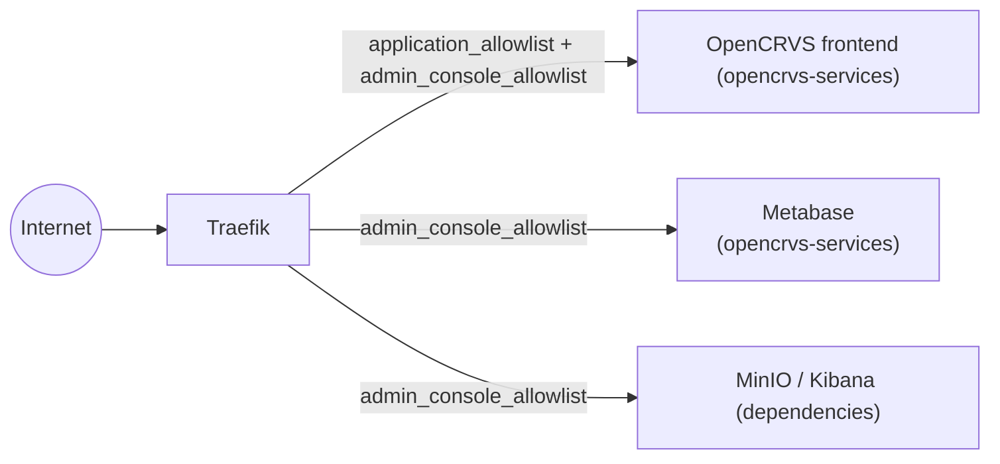

# IP Allowlisting


Both the `opencrvs-services` and `dependencies` Helm charts support Traefik middleware to restrict ingress access to their frontends. This guide focuses on allowlisting public internet ranges, but the same configuration works equally well for a private intranet.


#### Overview

Two independent CIDR allowlists restrict who can reach OpenCRVS over the public internet, enforced by a Traefik `ipAllowList` middleware at the ingress edge - before a request ever reaches an OpenCRVS pod. This is separate from the pod-to-pod Ingress/Egress access `NetworkPolicy` configuration, which only governs traffic already inside the cluster.


Both allowlists are empty by default, which leaves the corresponding routes publicly reachable. Configure at least `application_allowlist` for deployments that cannot run behind a VPN or private network.


* `ingress.admin_console_allowlist` - restricts the admin consoles:
  * MinIO and Kibana (`dependencies` chart)
  * Metabase dashboards console (`opencrvs-services` chart).
* `ingress.application_allowlist` - restricts the whole OpenCRVS application. `admin_console_allowlist` is always merged into the effective `application_allowlist`, so an IP address trusted for the admin consoles is never accidentally locked out of the application itself.


This is a plain IP allowlist, not geo-aware. It admits any request from the listed ranges regardless of where it actually originates, and rejects everything else regardless of origin. True country-level geoblocking would need a Traefik plugin or a CDN/WAF in front of the cluster.





#### Configuration options

| Value                             | Chart                               | Default | Description                                                 |
| --------------------------------- | ----------------------------------- | ------- | ----------------------------------------------------------- |
| `ingress.application_allowlist`   | `opencrvs-services`                 | `[]`    | Source IP ranges (CIDR) allowed to reach OpenCRVS frontend  |
| `ingress.admin_console_allowlist` | `opencrvs-services`, `dependencies` | `[]`    | Source IP ranges (CIDR) allowed to reach the admin consoles |

Both charts expose the setting under `ingress`:

```yaml
# opencrvs-services chart values.override.yaml
ingress:
  application_allowlist:
    # Allow access to OpenCRVS application from particular subnet
    - 203.0.113.0/24
  admin_console_allowlist:
    # Allow access to Metabase console from particular IP
    - 198.51.100.42/32
```

```yaml
# dependencies chart values.override.yaml
ingress:
  admin_console_allowlist:
    # Allow access to Kibana and Minio from multiple IP/subnet(s)
    - 198.51.100.42/32
    - 203.0.113.0/24
```

#### Behaviour

* Leaving a list empty (the default) leaves the corresponding routes publicly reachable - the Traefik `Middleware` resource for that list isn't even created.
* A request from an address outside the configured ranges receives Traefik's standard `403 Forbidden` for the `ipAllowList` middleware.
* Both charts recreate their `ipAllowList` middlewares on every `helm upgrade`, so the cluster always matches `values.override.yaml`.

For the complete reference, see:

* [`charts/opencrvs-services/README.md`](https://github.com/opencrvs/opencrvs-core/blob/develop/charts/opencrvs-services/README.md#hardening)
* [`charts/dependencies/README.md`](https://github.com/opencrvs/opencrvs-core/blob/develop/charts/dependencies/README.md#global-configuration-options)
