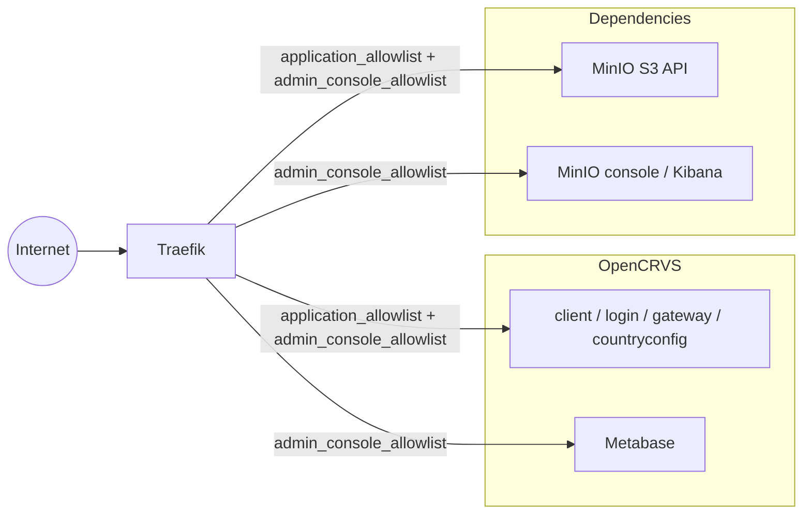

# IP Allowlisting


Both the `opencrvs-services` and `dependencies` Helm charts support Traefik middleware to restrict ingress access to their frontends. This guide focuses on allowlisting public internet ranges, but the same configuration works equally well for a private intranet.


#### Overview

Two independent CIDR allowlists restrict who can reach OpenCRVS over the public internet, enforced by a Traefik `ipAllowList` middleware at the ingress edge - before a request ever reaches an OpenCRVS pod. This is separate from the pod-to-pod Ingress/Egress access `NetworkPolicy` configuration, which only governs traffic already inside the cluster.


Both allowlists are empty by default, which leaves the corresponding routes publicly reachable. Configure at least `application_allowlist` for deployments that cannot run behind a VPN or private network.


* `ingress.admin_console_allowlist` - restricts the admin consoles:
  * MinIO and Kibana (`dependencies` chart)
  * Metabase dashboards console (`opencrvs-services` chart).
* `ingress.application_allowlist` - restricts the whole OpenCRVS application and API access (`opencrvs-services` chart) and the MinIO S3 API route (`dependencies` chart). `admin_console_allowlist` is always merged into the effective `application_allowlist`, so an IP address trusted for the admin consoles is never accidentally locked out of the application itself.


This is a plain IP allowlist, not geo-aware. It admits any request from the listed ranges regardless of where it actually originates, and rejects everything else regardless of origin. True country-level geoblocking would need a Traefik plugin or a CDN/WAF in front of the cluster.



```mermaid
flowchart LR
    I((Internet)) --> T[Traefik]

    subgraph SVC["OpenCRVS"]
        APP["client / login / gateway / countryconfig"]
        DASH["Metabase"]
    end

    subgraph DEP["Dependencies"]
        MINIO["MinIO S3 API"]
        CONS["MinIO console / Kibana"]
    end

    T -->|"application_allowlist + admin_console_allowlist"| APP
    T -->|"admin_console_allowlist"| DASH
    T -->|"application_allowlist + admin_console_allowlist"| MINIO
    T -->|"admin_console_allowlist"| CONS
```

Both charts expose the setting under `ingress`:

```yaml
# opencrvs-services chart values.override.yaml
ingress:
  application_allowlist:
    # Allow access to OpenCRVS application from particular subnet
    - 203.0.113.0/24
  admin_console_allowlist:
    # Allow access to Metabase console from particular IP
    - 198.51.100.42/32
```

```yaml
# dependencies chart values.override.yaml
ingress:
  admin_console_allowlist:
    # Allow access to Kibana and Minio from multiple IP/subnet(s)
    - 198.51.100.42/32
    - 203.0.113.0/24
```

#### Configuration options

All lists default to `[]`.

| Value                             | Chart               | Description                                                                                |
| --------------------------------- | ------------------- | ------------------------------------------------------------------------------------------ |
| `ingress.application_allowlist`   | `opencrvs-services` | Source IP ranges (CIDR) allowed to reach `client`, `login`, `gateway` and `countryconfig`. |
| `ingress.application_allowlist`   | `dependencies`      | Source IP ranges (CIDR) allowed to reach the MinIO S3 API route.                           |
| `ingress.admin_console_allowlist` | `opencrvs-services` | Source IP ranges (CIDR) allowed to reach the Metabase dashboards console.                  |
| `ingress.admin_console_allowlist` | `dependencies`      | Source IP ranges (CIDR) allowed to reach the MinIO console and Kibana.                     |

#### Behaviour

* Leaving a list empty (the default) leaves the corresponding routes publicly reachable - the Traefik `Middleware` resource for that list isn't even created.
* A request from an address outside the configured ranges receives Traefik's standard `403 Forbidden` for the `ipAllowList` middleware.
* Both charts recreate their `ipAllowList` middlewares on every `helm upgrade`, so the cluster always matches `values.override.yaml`.
* Routes of the MOSIP integration chart (`opencrvs-mosip`) are not covered by these allowlists.


**MinIO S3 API:** browsers download supporting documents directly from MinIO using presigned URLs. Only set `ingress.application_allowlist` on the `dependencies` chart if every OpenCRVS user connects from the listed ranges, otherwise users outside them will not be able to view attachments.



**Client IP address:** the allowlist is matched against the source IP address seen by Traefik. The default OpenCRVS installation exposes Traefik directly on the master node ports 80 and 443, so the real client IP is preserved. If you run a load balancer, reverse proxy or NAT in front of Traefik, make sure it preserves the client source IP, otherwise all requests appear to come from the load balancer address.


For the complete reference, see:

* [`charts/opencrvs-services/README.md`](https://github.com/opencrvs/opencrvs-core/blob/v2.1.0/charts/opencrvs-services/README.md#hardening)
* [`charts/dependencies/README.md`](https://github.com/opencrvs/opencrvs-core/blob/v2.1.0/charts/dependencies/README.md#global-configuration-options)
