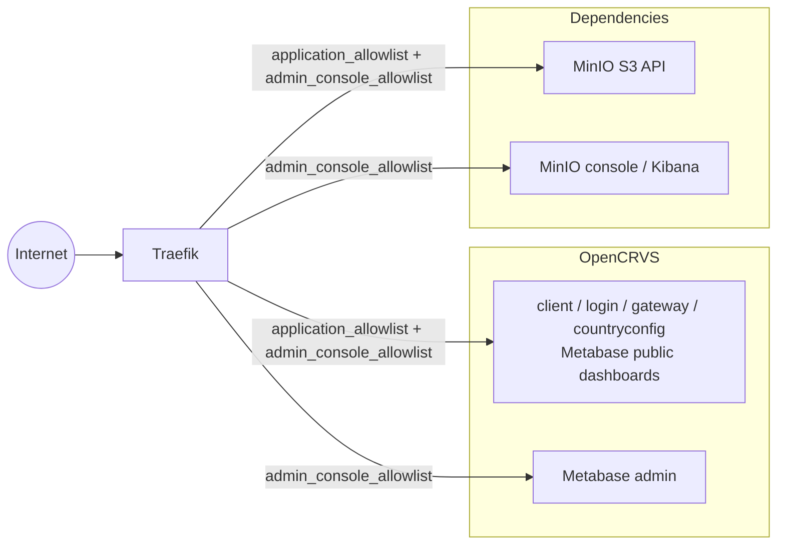

# IP Allowlisting


Both the `opencrvs-services` and `dependencies` Helm charts support Traefik middleware to restrict ingress access to their frontends. The same configuration works for deployments on the public internet and on a private network.


#### Overview

Two CIDR allowlists restrict who can reach OpenCRVS, enforced by a Traefik `ipAllowList` middleware at the ingress edge - before a request ever reaches an OpenCRVS pod. This is separate from the pod-to-pod Ingress/Egress access `NetworkPolicy` configuration, which only governs traffic already inside the cluster.

* `ingress.application_allowlist` - restricts the OpenCRVS application and API: `client`, `login`, `gateway`, `countryconfig`, the Metabase public dashboards embedded in the Performance page (`opencrvs-services` chart) and the MinIO S3 API used for document downloads (`dependencies` chart).
* `ingress.admin_console_allowlist` - restricts the admin consoles:
  * MinIO console and Kibana (`dependencies` chart)
  * Metabase admin console (`opencrvs-services` chart)


Both allowlists are empty by default, which leaves the corresponding routes reachable by anyone who can reach Traefik. If OpenCRVS is reachable from the public internet without a VPN, set both lists in both charts, as described below.


#### The two allowlists are configured independently

* `application_allowlist` does not restrict the admin consoles. If `admin_console_allowlist` is empty, Metabase admin, Kibana and the MinIO console stay open even when `application_allowlist` is set.
* `admin_console_allowlist` never restricts the application on its own. When `application_allowlist` is set, the addresses in `admin_console_allowlist` are added to it automatically, so you don't need to repeat them. When `application_allowlist` is empty, the application stays open.


**Metabase public dashboards do not require an OpenCRVS login.** The Performance page embeds them through Metabase public links, and their URLs are published in the client configuration, which is served without login. Anyone who can reach the public dashboard paths on `metabase.<domain>` (`/public/`, `/app/`, `/api/public/`, `/api/geojson/` and `/api/session/properties`) can view the dashboard data. These paths follow `application_allowlist`, not `admin_console_allowlist`.



```mermaid
flowchart LR
    I((Internet)) --> T[Traefik]

    subgraph SVC["OpenCRVS"]
        APP["client / login / gateway / countryconfig<br/>Metabase public dashboards"]
        DASH["Metabase admin"]
    end

    subgraph DEP["Dependencies"]
        MINIO["MinIO S3 API"]
        CONS["MinIO console / Kibana"]
    end

    T -->|"application_allowlist + admin_console_allowlist"| APP
    T -->|"admin_console_allowlist"| DASH
    T -->|"application_allowlist + admin_console_allowlist"| MINIO
    T -->|"admin_console_allowlist"| CONS
```

#### Choose where to filter IP addresses

Use only one of these options:

1. **IP filtering by a WAF (recommended).** A Web Application Firewall in front of OpenCRVS decides which users may connect. The Traefik allowlists only admit the WAF's addresses, so users cannot bypass it by connecting to your servers directly. A WAF can also filter by country (geo-IP), which Traefik cannot.
2. **IP filtering by Traefik.** The Traefik allowlists contain the networks your users connect from.

You cannot combine them: behind a WAF that proxies traffic (as cloud WAFs do), every request reaches Traefik from the WAF's own IP addresses, so Traefik cannot tell users apart.


OpenCRVS does not ship, configure or support a WAF. Choosing and operating one is the responsibility of the system integrator. See [Why VPN?](why-vpn.md).


#### What to put in the allowlists

What Traefik sees as the source IP address depends on where it sits in your network.

**Traefik on the public internet, behind a WAF**

* `application_allowlist` and `admin_console_allowlist`: the WAF's egress IP addresses, as published by your WAF provider. Keep them up to date, because providers change them. If these addresses are shared with the provider's other customers, ask your provider how to protect your servers from traffic sent through other accounts.
* Configure which users and administrators may connect in the WAF itself.
* Route every OpenCRVS hostname through the WAF. Hostnames that bypass the WAF receive `403 Forbidden`.

**Traefik on the public internet, without a WAF**

* `application_allowlist`: the networks your users and integrations connect from, using one or more of:
  * **Office public IPs** - static public IP addresses of registration offices, health facilities and ministries.
  * **Provider subnets** - IP ranges of the internet and mobile providers your staff use. Ask the providers for their current ranges.
  * **Country subnets** - all IP ranges registered to your country, from your Regional Internet Registry's delegated statistics (for example, AFRINIC for African countries).

  Also include systems that call the OpenCRVS API (for example National ID or health systems) and any external uptime monitoring.
* `admin_console_allowlist`: only the static IP addresses of your system administrators, for example the office network or a bastion host.

Anyone connecting from outside the listed ranges receives `403 Forbidden`, including staff who travel or use a mobile provider you did not list. Country subnets are based on where an IP range is registered, not where it is used, so review all lists regularly.

**Traefik behind a load balancer**

* Forward the load balancer to ports 80/443 on the ingress node, where Traefik listens. This is the node labelled `traefik-role: ingress`, the master node by default.
* `application_allowlist` and `admin_console_allowlist`: the load balancer's private IP address or subnet. Check `ClientHost` (see below) before you set the lists.
* This only ensures that traffic arrives through the load balancer. Restrict which users may connect at the load balancer, or at the WAF or firewall in front of it.
* If your load balancer keeps the client's IP address as the connection's source address (a TCP pass-through load balancer), Traefik sees the real client addresses: follow the public internet guidance above instead.

The lists match only the connection's source address. `X-Forwarded-For` headers are not used, and PROXY protocol is not enabled on the OpenCRVS Traefik entry points, so do not enable it on the load balancer.

**Traefik on a private network**

Use `application_allowlist`, `admin_console_allowlist` or both to narrow access further, based on your network topology. For example, allow the VPN client, office and integration subnets in `application_allowlist`, and only the administrators' or bastion subnet in `admin_console_allowlist`.


To check which source address Traefik sees, look at the `ClientHost` field in the Traefik access log (requires [cluster access](kubernetes-cluster-access.md)):

```bash
kubectl logs -n traefik -l service_name=traefik --prefix --tail=20
```


#### Configuration options

| Value                             | Chart               | Default | Restricts                                                                                                |
| --------------------------------- | ------------------- | ------- | -------------------------------------------------------------------------------------------------------- |
| `ingress.application_allowlist`   | `opencrvs-services` | `[]`    | `client`, `login`, `gateway`, `countryconfig` and the Metabase public dashboards                         |
| `ingress.application_allowlist`   | `dependencies`      | `[]`    | The MinIO S3 API. Browsers and integrations download documents from it through presigned URLs.           |
| `ingress.admin_console_allowlist` | `opencrvs-services` | `[]`    | The Metabase admin console                                                                               |
| `ingress.admin_console_allowlist` | `dependencies`      | `[]`    | The MinIO console and Kibana                                                                             |

Each chart reads only its own values, so set the lists in both charts. If you set `application_allowlist` in the `dependencies` chart, it must include every network that users and integrations download documents from.

Routes published by other charts are not covered by these lists: `mosip-api.<domain>` and `esignet-mock.<domain>` (`opencrvs-mosip` chart) and the hostname of each `opencrvs-addon` release. If these routes are reachable from the public internet, restrict them at your WAF or network firewall.

```yaml
# opencrvs-services chart values.override.yaml
ingress:
  application_allowlist:
    # Allow access to the OpenCRVS application from a particular subnet
    - 203.0.113.0/24
  admin_console_allowlist:
    # Allow access to the Metabase admin console from a particular IP
    - 198.51.100.42/32
```

```yaml
# dependencies chart values.override.yaml
ingress:
  application_allowlist:
    # Allow document downloads from the same subnet as the application
    - 203.0.113.0/24
  admin_console_allowlist:
    # Allow access to Kibana and the MinIO console from a particular IP
    - 198.51.100.42/32
```

#### Apply and verify

1. In your infrastructure repository, edit `environments/<env>/opencrvs-services/values.override.yaml` and `environments/<env>/dependencies/values.override.yaml`, then commit and push the change to the branch you run the workflows from.
2. Run the **02. Deploy Dependencies** and **03. Deploy OpenCRVS** workflows.
3. From a network that is not in the lists, run `curl -I https://register.<domain>` and check that it returns `403 Forbidden`. Use a network you have not allowlisted, for example a cloud server outside your country; mobile data often belongs to a provider or country subnet you listed. Behind a WAF, test your server directly instead, bypassing the WAF: `curl -I --resolve register.<domain>:443:<server public IP> https://register.<domain>` must return `403 Forbidden`.
4. From an address that is in `application_allowlist` but not in `admin_console_allowlist`, check that `curl -I https://kibana.<domain>` returns `403 Forbidden`, and that the Performance page still shows its dashboards.

If you lock yourself out, deployments still work, because they use the Kubernetes API rather than Traefik. Correct the lists and deploy again.

#### Behaviour

* Leaving a list empty (the default) leaves the corresponding routes open - the Traefik `Middleware` resource for that list isn't even created.
* A request from an address outside the configured ranges receives Traefik's standard `403 Forbidden` for the `ipAllowList` middleware.
* Changes take effect on the next deployment. Emptying a list removes its middleware.

For the complete reference, see:

* [`charts/opencrvs-services/README.md`](https://github.com/opencrvs/opencrvs-core/blob/v2.1.0/charts/opencrvs-services/README.md#hardening)
* [`charts/dependencies/README.md`](https://github.com/opencrvs/opencrvs-core/blob/v2.1.0/charts/dependencies/README.md#global-configuration-options)
