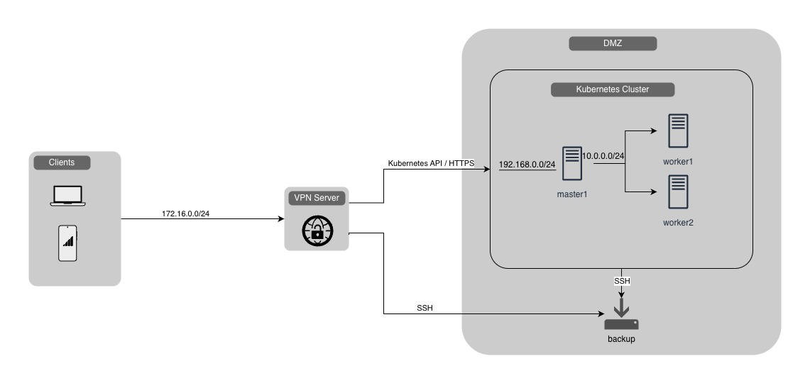

# Ubuntu Firewall configuration

### Overview

The firewall follows a default-deny approach:

* All inbound traffic is denied by default.
* Only ports required for cluster operation are opened.
* Firewall rules are managed automatically by Ansible.
* Existing OpenCRVS-managed rules are removed and recreated during each deployment to ensure configuration consistency.

### Unrestricted access

* `SSH`: All nodes allow inbound SSH connections on TCP port 22.
* `HTTP/HTTPS`: Control plane node (master) allows inbound traffic on 80 and 443 ports. These ports are used by Traefik to expose OpenCRVS services.

### Kubernetes API

Control plane node allows access to the Kubernetes API server on TCP port 6443 from:

* All Kubernetes cluster nodes
* Additional CIDR ranges specified through the `kubernetes_api_allowed_cidrs` configuration option

This allows cluster components to communicate with the API server while enabling operators to restrict administrative access to trusted networks.

### Internal Cluster Communication

OpenCRVS automatically discovers all Kubernetes node IP addresses and creates firewall rules allowing communication between cluster members only.

The following ports are opened between cluster nodes:

| Port  | Protocol | Purpose                         |
| ----- | -------- | ------------------------------- |
| 179   | TCP/UDP  | Calico BGP                      |
| 4789  | UDP      | Calico VXLAN overlay networking |
| 5473  | TCP      | Typha daemon                    |
| 6443  | TCP      | Kubernetes API Server           |
| 7946  | TCP/UDP  | Cluster networking components   |
| 8472  | UDP      | VXLAN overlay networking        |
| 10250 | TCP      | Kubelet API                     |


`etcd` communication ports (2379 and 2380) are not exposed publicly and are intended only for control plane communication within the cluster.

To support Calico networking, inbound traffic is allowed on the following interfaces:

* `cali+`
* `vxlan.calico`


### Configuration options

There are several ways to control access to the Kubernetes API. The diagram below shows the two configurations supported by the OpenCRVS provision script.

<figure><figcaption></figcaption></figure>

#### Default configuration

Use this configuration when the Kubernetes cluster does not have a dedicated subnet, or all servers (including the backup server) are in the same subnet.

By default:

* HTTP(S) and SSH access is allowed.
* Kubernetes API access is allowed only from the master and worker nodes.

Configuration:

* **KUBE\_MASTER\_NODE** – Leave empty if the master has a single network interface. Otherwise, specify the desired master node IP address.
* **KUBE\_WORKER\_NODES** – Worker node IP addresses.
* **KUBE\_API\_HOST** – Leave blank to use `KUBE_MASTER_NODE`.
* **KUBE\_API\_ALLOWED\_CIDRS** – Leave blank to block Kubernetes API access from all networks except the worker nodes.

#### Split Kubernetes API endpoint from master node IP

This configuration provides additional security and network isolation.

In this setup:

* The Kubernetes cluster uses a dedicated subnet (for example, `10.0.0.0/24`) that is not accessible to VPN clients.
* The master node has a secondary IP address that exposes the HTTP(S) and Kubernetes API endpoints (for example, `192.168.0.0/24`).
* VPN clients access the HTTP(S) and Kubernetes API endpoints from their own subnet (for example, `172.16.0.0/24`).

Configuration:

* **KUBE\_MASTER\_NODE** – `10.0.0.X` (primary IP address in the Kubernetes subnet).
* **KUBE\_WORKER\_NODES** – `10.0.0.X` (worker node IP addresses in the Kubernetes subnet).
* **KUBE\_API\_HOST** – `192.168.0.X` (secondary IP address exposed to VPN clients).
* **KUBE\_API\_ALLOWED\_CIDRS** – `172.16.0.0/24` and any other approved subnets.

#### GitHub variables reference


All variables are configured by `environment:init` script, use this documentation only for reference


| GitHub variable           | Ansible variable          | Description                                                                                                         |
| ------------------------- | ------------------------- | ------------------------------------------------------------------------------------------------------------------- |
| KUBE\_MASTER\_NODE        | kube\_master\_node        | Master node IP address                                                                                              |
| KUBE\_API\_HOST           | kube\_api\_host           | Kubernetes API IP / Hostname (by default is same as Master node IP                                                  |
| KUBE\_API\_ALLOWED\_CIDRS | kube\_api\_allowed\_cidrs | Subnets approved to access Kubernetes API server (master). Comma-separated list (e/g: `10.0.0.0/16,192.168.0.0/24`) |
| KUBE\_WORKER\_NODES       | n/a                       | Kubernetes worker nodes. Comma-separated list (e/g: `10.0.0.2,10.0.0.3,10.0.0.4`)                                   |

