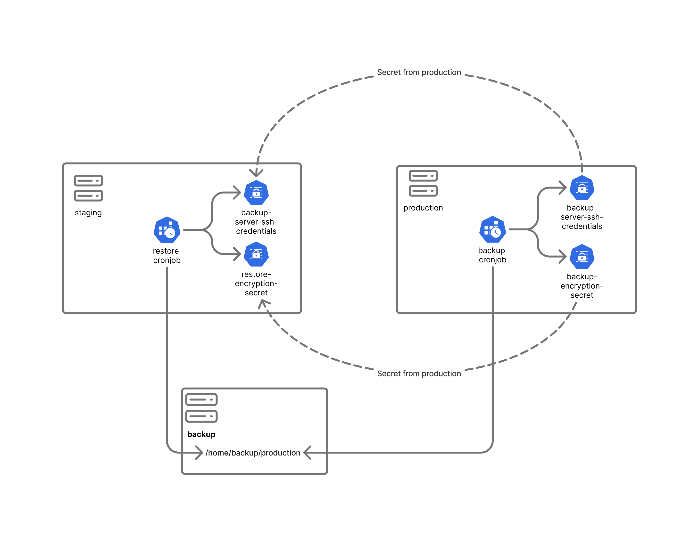

# Backup & Restore configuration

### General information


Backup and restore are configured automatically during environment creation by the `yarn environment:init` script. See **Create a GitHub Environment** for the standard setup process.

This guide covers the following advanced topics:

* Run backup and restore manually from GitHub.
* Configuring backup and restore without GitHub integration.
* Performing manual backups and restore.
* Performing disaster recovery.


OpenCRVS dependencies helm chart has an configuration options for automated backups and restores.

OpenCRVS dependencies helm chart includes a built-in backup and restore features that supports automated backups and restores for internal components (data stores). Backups are uploaded on an external server via an SSH connection.

Supported data stores:

* PostgreSQL
* MinIO


Elasticsearch doesn't support backup and restore, please use re-index job instead


### Backup and restore configuration flow

"Deploy dependencies" GitHub Actions workflow configure backup and restore at deployment time and creates all required secrets.

The following outlines the high-level backup and restore configuration:

* Production servers should be configured to run backup jobs only.
* Staging servers should be configured to run restore jobs only.
* The private SSH key used by the restore job must match the one used on the production server.
* The backup encryption key on the production server and the restore decryption key on the staging server must be identical.

<figure><figcaption></figcaption></figure>

### Backup types

Following backup types are supported by data stores:

* Postgres:
  * `dump`: (Default) Database dump, without instance configuration. Backup is performed by `pg_dump` utility. Database credentials are preserved. Backup is suitable for average country with small population (up to 1 million of people).
  * `differential` : Differential backup between last full backup. Backup is performed at instance (cluster) level by `pgBackRest` tool. Database credentials are replaced with credentials from backup server at restore time. By default weekly full and daily differential backups are made.
* MinIO:
  * `dump`: (Default) Full filesystem copy clone archived and encrypted on daily basics.
  * `differential`: Full filesystem copy mirrored on remote backup server folder with rsync.

Please check helm chart documentation and `values.yaml` for more information about available configuration options. Backup schedule and backup types.

### Backup and restore configuration

Each datastore has its own backup job, implemented as a Kubernetes `CronJob`. Backup and restore settings are defined in the `backup` (`restore`) section of the chart values file. Each datastore can have its own schedule and remote directory on the backup server.

Example:

```yml
minio:
  backup:
    schedule: "0 1 * * *"
postgres:
  backup:
    schedule:
      dump: "0 2 * * *"
```

Refer to the Helm chart documentation and `values.yaml` for details about the available configuration options. For example, PostgreSQL supports multiple backup types.

Typically, backup jobs are configured only in the production environment, while restore jobs are configured only in the staging environment. However, there are no restrictions on configuring backup or restore on other environments. For example, backup and restore can be configured between development and QA environments for testing purposes.

Backup server configuration is fully automated using Ansible playbooks. To bootstrap a backup server, provide its IP address or hostname to the `yarn environment:init` script and run the bootstrap process.


A server can have either backup or restore configured — never both at the same time.


### Backup server filesystem structure

Full backups are stored as compressed and encrypted archives in the backup server's remote repository. The repository is organized as follows:

* Backup directories are structured by date.
* Each backup directory contains one encrypted archive for each datastore.

The following example shows the directory structure of the remote backup repository:

```
backup@poc-backup:~$ ls -l /home/backup/production/
total 60
drwxrwxr-x 2 backup backup 4096 Feb  5 01:00 2026-02-05
...
drwxrwxr-x 2 backup backup 4096 Feb 13 01:00 2026-02-13
backup@poc-backup:~$ ls -l /home/backup/production/2026-02-05
total 124
-rw-r--r-- 1 backup backup   112 Feb  5 01:00 minio_backup_2026-02-05.tar.gz.enc
-rw-r--r-- 1 backup backup 33040 Feb  5 01:00 postgres_backup_2026-02-05.tar.gz.enc
```

Differential backups are stored uncompressed on the backup server and are not organized into date-based directories.

For PostgreSQL, differential backups are managed by `pgBackRest`. The only configurable option is the destination directory.

In this example the folder `/home/backup/production/postgres/` is managed by `pgBackRest`:

```
backup@poc-backup:~$ ls -l /home/backup/production/postgres/
total 8
drwxr-x--- 3 backup backup 4096 Feb 17 16:07 archive
drwxr-x--- 3 backup backup 4096 Feb 17 16:07 backup
```

